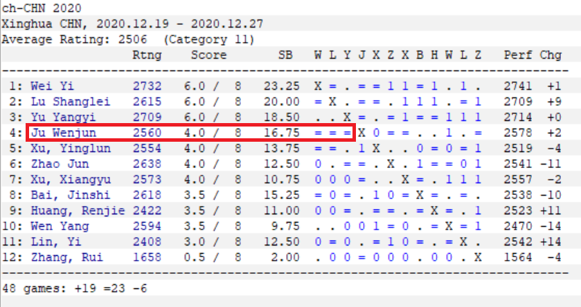
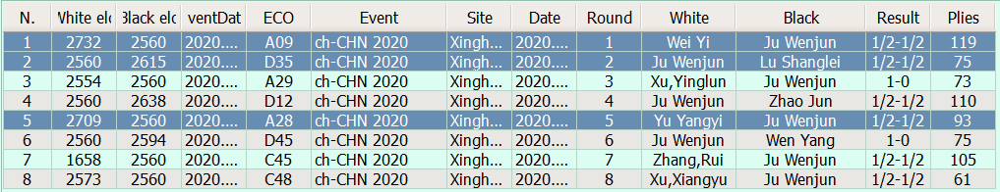
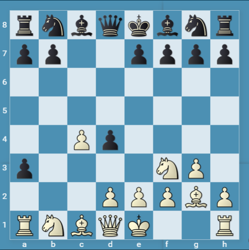
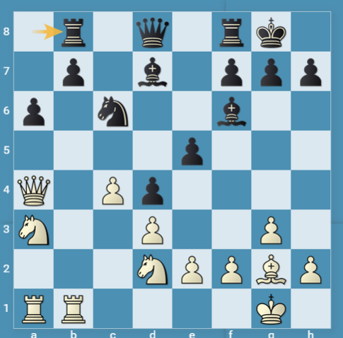
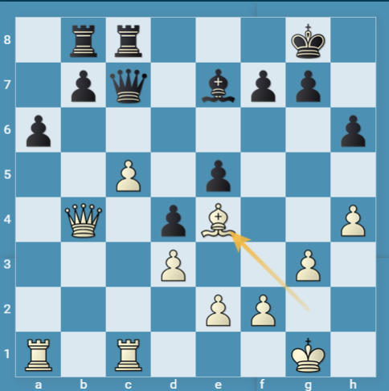
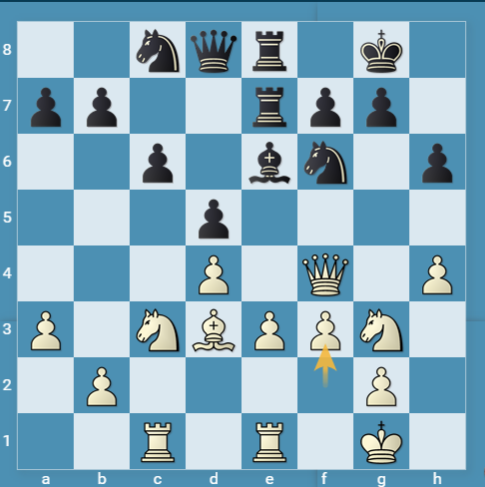
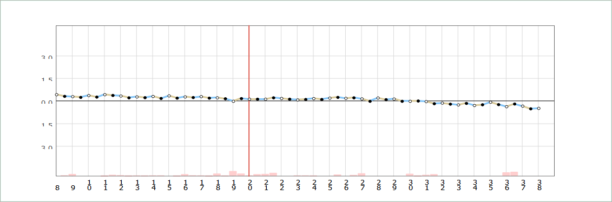
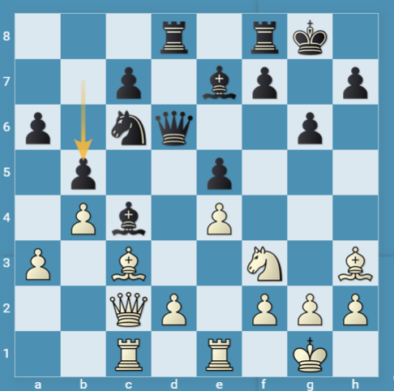

# Championnat de Chine 2020

  
*Xinghua, du 19 au 30 décembre 2020*

## Classement après 8 Rondes

Ju Wenjun, Championne du Monde en titre, participait au tournoi Open - et non au tournoi féminin - du Championnat de Chine disputé à Xinghua du 19 au 30 décembre 2020.

Après 8 Rondes, trois leaders se détachent nettement.  
Cependant, aucun d'eux - pourtant dotés d'`Elo` supérieurs de 55 à 172 points - n'a pu vaincre Ju Wenjun.

Mieux : à aucun moment, la Championne du Monde n'a paru menacée.  
Qu'on en juge ci-dessous.

## Round 1 - Yi WEI - Wenjun JU

Tout commence par un début étrange (**1. Cf3 d5 2. c4 d4 3. b4 c5 4. g3 cxb4 4. a3?! bxa3 5. Fg2?!** - **Diag1**) où Wei Yi se permet le luxe de se priver de ses deux pions de l'Aile Dame.

**Diag1**  5. Fg2 `-0.19 Komodo 10 32bit 5'` (sont meilleurs 5. e3 `+0.00` et 5. Fxa3 `-0.01`)
  

Puis, il continue à jouer avec un pion en moins, sans tirer profit de son avantage intitial de développement, ni de ses six pions `c à h`liés.

**Diag2** *Position après 14... Tb8*  (`-0.55 Komodo 10 32bit 5'`)
  

Rien d'irrémédiable jusqu'alors donc.  
Mais c'est à ce moment que Wei Yi joua **15. c5**, qui aboutit à se faire capturer ce pion c5 sans la moibdre contrepartie au 23ème coup.  
**Diag3** `1rr3k1/1pq1bpp1/p6p/2P1p3/1Q1pB2P/3P2P1/4PP2/R1R3K1 b - - 0 23`  
*Position juste avant 23... Fxc5 chassant la Dame et laissant Ju Wenjun avec deux pions de plus.*   
   

Aucun problème donc pour Ju Wenjun lors de cette première partie du championnat.  
Si elle fit nulle (1/2-1/2, 60.), c'est pour avoir accepté trop d'échanges, ce qui l'empêcha de conserver ses pions d'avance, et la priva de pièces (T+F de cases noires contre T+F de cases blanches) en soutien de ses pions passés a et b.

## Round 2 - Wenjun JU - Shanglei LU

Un début conservateur de part et d'autre (**1. d4 Cf6 2. c4 e6 3. Cc3 d5 4. cxd5 exd5 5. Fg5 c6 6. e3 h6 7. Fh4 Fe6 8. Fd3 Cbd7**) du Gambit de la Dame où les Noirs ont tout le temps de s'abriter et d'empêcher la poussée e3-e4.

Si bien qu'après le coup **20. f3** (voir **Diag4**) qui permet de penser que e3-e4 pourrait se produire,  
  
les Noirs peuvent se permettre de jouer tranquillement **20... Rf8** avec une position sensiblement égale (`+0.14 Komodo 10 32bit 5'`)

Tout au long de la partie, l'évaluation a oscillé autour de `+ 0.00`  
  
*Graphique réalisé à partir des évaluations de chaque coup après 5" de *Komodo 10 32bit*

## Round 5 - Yangyi YU - Wenjun JU

Du 8ème au 14ème coup, Ju Wenjun a eu le temps de jouer quatre coups de Dame (Dxd5-d6-e6-d6) sans que ne change grandement la position (les Blancs ayant développé leur Ff1 à f5 *via* d3 et e4 et leur Fc1 en b2 pendant que les Noirs développaient leur Fc8 en d5 *via* e6 et leur centralisaient leur Tour de l'Aile Dame).

Après les roques respectifs, on se retrouve dans la position du **Diag5** où la batterie `T+D` des Noirs est contrebalancée par une excellente paire de Fous blancs, le tout dans une position ou les `leviers` (c'est-à-dire les possibilités d'échanges entre pions de telle manière à quelque peu déstabiliser la position, affaiblir la structure des pions, ouvrir certaines colonnes, etc.) sont pratiquement inexistants.

  
**Diag5** `3r1rk1/2p1bp1p/p1nq2p1/1p2p3/1Pb1P3/P1B2N1B/2QP1PPP/2R1R1K1 w - - 0 20`  
*Position après 19... b5* (`+0.10 Komodo 10 32bit 5'`)

Que tirer d'une telle position dans ces conditions pour Yu Yangyi ?  
La partie se concluera donc par la nulle après 47 coups.

Dans les trois parties, la Championne du Monde a parfaitement maîtrisé le jeu de ses adversaires, s'octroyant même une bonne chance de battre Wei Yi à la première ronde.

> [Téléchargement](ChCHN_2020.pgn) de ces trois parties

