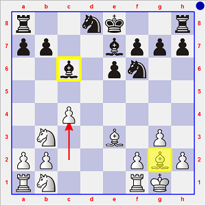
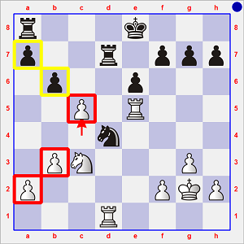
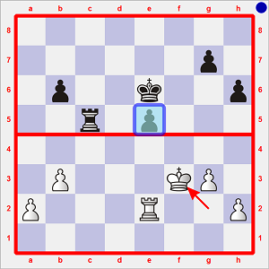
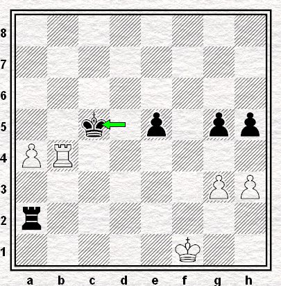

# Ronde 1. Andersson - De Firmian

**1. Cf3 c5 2. g3 d5 3. Fg2 Cc6 4. d4 cxd4 5. Cxd4 e6 6. O-O Fc5 7. Cb3 Fe7 8. e4 dxe4 9. Dxd8+ Cxd8 10. Fxe4 Cf6 11. Fg2 Fd7 12. Fe3 Fc6 13. c4**

`r2nk2r/pp2bppp/2b1pn2/8/2P5/1N2B1P1/PP3PBP/RN3RK1 b kq c3 0 13`

 (après 13. c4)

L'Américain décide de pacifier encore davantage la position par **13... Fxg2 14. Rxg2** (`-0.15 Stockfish 6 30"`)

La phase suivante n'est marquée que par l'échange de deux paires de pièces légères :  
**14... Cc6 15. Cc3 Cg4 16. Fc5 b6 17. Fxe7 Rxe7 18. Tad1 Thd8 19. Cc1 Cge5 20. b3 Cd4 21. Tfe1 Cec6 22. Cd3 Td7 23. Ce5 Cxe5 24. Txe5 Re8**

La structure de pions restant le seul élément dynamique de la position, Andersson cherche à l'accentuer par **25. c5**, même s'il sait que la position résultant de 25... bxc5 26. Txc5 (`+0.13`) ne serait guère exploitable au vu de l'éloignement des pions a2-b3/a7 et de la forte probabilité d'échanges des Cavaliers et d'une paire de Tours.

`r3k3/p2r1ppp/1p2p3/2P1R3/3n4/1PN3P1/P4PKP/3R4 b - - 0 25`

 (après 25. c5 `-0.08`)

Mais son adversaire ne rentre pas dans ce jeu.  
Il profite de la position en l'air de la Te5 pour procéder sans tarder aux échanges simplificateurs :  
**25... Cc6 26. Txd7 Rxd7 27. Th5 h6 28. cxb6 axb6**.  
Ceci fait, chaque adversaire saisit l'opportunité de borner durablement son camp : **29. Th4 Ta5**.

`8/3k1pp1/1pn1p2p/r7/7R/1PN3P1/P4PKP/8 w - - 2 30`

 (après 29... Ta5 `-0.23`)

L'ordinateur accorde un avantage symbolique aux Noirs, car ils disposent avec le pion e6 du seul élément potentiellement perturbateur de ce *Yalta*. Cependant, les rangées 4 et 5 vides, sans compter le vaste espace de manœuvre en arrière des Rois sur les rangées 1 et 8 et sur les colonnes centrales d et e, font que toute avancée de ce pion se ferait en terrain miné.

De fait, 13 mouvements plus tard (**30. Te4 e5 31. Te2 Cd4 32. Td2 Re6 33. f4 f6 34. Ce2 Cxe2 35. Txe2 Tc5 36. fxe5 fxe5 37. Rf3**) et malgré la création d'un pion passé après l'échange des pions f au prix de la disparition des Cavaliers, les deux joueurs doivent admettre que la position n'a pas fondamentalement changé de nature :

`8/6p1/1p2k2p/2r1p3/8/1P3KP1/P3R2P/8 b - - 1 37`

 (après 37. Rf3 `-0.17`)

Aucun pion ne pouvant franchir la ligne de démarcation, la nulle sera conclue sans fracas ni tracas :  
**37... Tc1 38. Re4 b5 39. Rf3 h5 40. a4 bxa4 41. bxa4 Ta1 42. Te4 Ta3+ 43. Rf2 Ta2+ 44. Rg1 Rd5 45. Tb4 g5 46. h3 Rc5 47. Te4 Rd6 48. Tb4 Rd5 49. Rf1 Rc5 1/2-1/2**

  
**Diagramme 1** : Andersson-De Firmian, position finale  
`8/8/8/2k1p1pp/PR6/6PP/r7/5K2 w - - 0 50`
