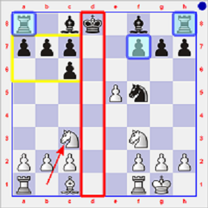
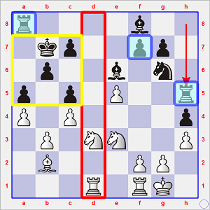
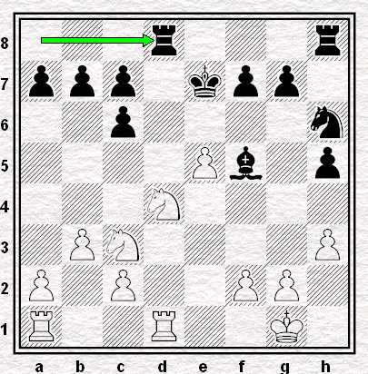
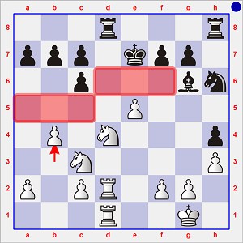
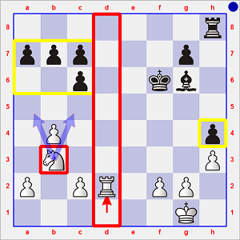
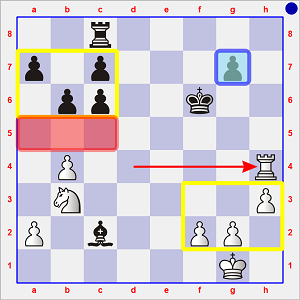
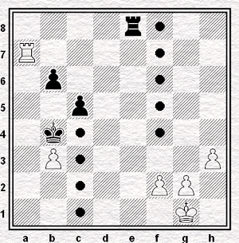
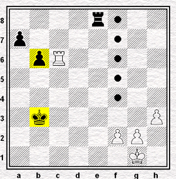

# Ronde 1. Karpov - Miles

**1. e4 e5 2. Cf3 Cc6 3. Fb5 Cf6**  

Au terme d'une pratique plus que centenaire, la Défense berlinoise de la Partie Espagnole (ou _Ruy Lopez_, du nom de l'évêque espagnol [**RUY LOPEZ DE SEGURA**](https://fr.wikipedia.org/wiki/Ruy_L%C3%B3pez), meilleur joueur du XVIème Siècle) s'avère, considérée du point de vue des Noirs, une défense solide.  

Elle est réputée comme offrant les meilleures chances théoriques aux Blancs en raison de la disparition fréquente du pion e5 ainsi que de la faiblesse dont les Noirs ne peuvent se défaire, à savoir celle du doublement des pions noirs sur la colonne c.  
Ce n'est cependant qu'en finale, et pour autant qu'ils soient habiles et rigoureux, que les Blancs peuvent espérer faire prévaloir leur saine structure de pions ; en milieu de jeu, les Noirs disposent en général d'un jeu agréable et peuvent voir venir les menaces d'assez loin, tant l'exécution des plans adverses s'avère en général plutôt lente.

**4. O-O**  

Ce coup inaugure la Variante Ouverte (`C67 : Ruy Lopez Berlin Defense Open Variation`), dans la mesure où les Blancs n'y cherchent pas à protéger leur pion e4, et préfèrent au contraire ouvrir les lignes en grand.

**4... Cxe4 5. d4 Cd6 6. Fxc6 dxc6 7. dxe5 Cf5**  

En septembre 1958, alors âgé de 15 ans, Robert J. (dit _Bobby_) **FISCHER** avait préféré conserver les Dames sur l'échiquier.  

Il joua 8. De2 mais se rendit très rapidement compte qu'il n'obtiendrait rien de vraiment concret contre Oleg **NEIKIRCH** (Bulgarie) à la 1ère Ronde du Tournoi Interzonal de Ljubljana/Portoroz (Yougoslavie) : 8... Cd4 9. Cxd4 Dxd4 10. Cc3 Fg4 11. De3 Dxe3 12. Fxe3 Fb4 13. Ce4 Ff5 14. c3 Fxe4 15. cxb4 a5 16. bxa5 Txa5 1/2-1/2.

Karpov adopte quant à lui la suite traditionnelle et considérée à son époque comme la plus solide, laquelle consiste à échanger les Dames, puis à continuer tranquillement le développement des pièces blanches :  
**8. Dxd8+ Rxd8 9. Cc3**

---

## Encadré : des deux manières d'aborder la Berlinoise.

  
(après 1. e4 e5 2. Cf3 Cc6 3. Fb5 Cf6 4. O-O Cxe4 5. d4 Cd6 6. Fxc6 dxc6 7. dxe5 Cf5 8. Dxd8+ Rxd8 9. Cc3)

La menace pour les Noirs se situe de toute évidence le long de la colonne d : tôt ou tard, une Tour blanche viendra en d1 pour la dominer sans partage et délimiter l'échiquier en deux zones ; or, le Roi noir déroqué au coup précédent se trouve dans cet inconfortable *courant d'air*.  
Le Roi peut cependant retourner d'où il vient sans craindre d'abandonner les quatre pions de l'Aile Dame : en effet, aucun pion ni aucune pièce blanche ne sera à portée d'eux avant très longtemps.

### A) 9... Re8

En choisissant la ligne classique **9... Re8**, Miles sait aussi qu'il vient au secours de son pion le plus faible, à savoir f7, car celui-ci pourra être assailli (dans l'immédiat) par Cf3-g5 et (à terme) par l'avancée e5-e6.

Avec le coup 9... Re8, les Noirs doivent se préparer à l'idée qu'ils joueront en pratique le **milieu de partie avec deux pièces utiles en moins** par rapport à leur adversaire, car la perte du droit de roquer a provoqué un isolement à la périphérie aussi préjudiciable que durable des deux Tours.

C'est de ce vécu navrant de la *Berlinoise* pour les Noirs dont a voulu se départir Vladimir **[KRAMNIK](https://fr.wikipedia.org/wiki/Vladimir_Kramnik)** (Russie) alors qu'il peaufinait la préparation de son match-défi contre Garri **[KASPAROV](https://fr.wikipedia.org/wiki/Garry_Kasparov)** en 2000.

Puisqu'en ce neuvième coup de la partie, aucune de leurs pièces n'est en prise, les Noirs disposent en réalité d'un tempo bienvenu. Ils pourraient l'utiliser pour construire un abri durable pour leur Roi.  

C'est alors que Kramnik eut l'idée d'interposer le Fou sur la colonne d afin d'accorder deux degrés de liberté au Roi :

* soit, le déplacer comme d'habitude dans la *Berlinoise* vers e8 mais sans jamais concéder le contrôle de la case d8 à une Tour qui viendrait en d1 ;
* soit, faire pivoter le Roi en sens opposé, à savoir derrière la rocade (roque artificiel) formée par la masse des pions de l'Aile Dame ; le Roi pourrait choisir de demeurer en c8, mais aussi (après une simple poussée b7-b6) d'aller sur la case *tranquille* b7.

De toute façon, qu'il s'installe en b7, c8 ou e8, le Roi noir sera au calme aussi longtemps qu'il sera sur une case blanche, puisque la disparition de la Dame et du Fou blancs fait que **les Noirs sont les maîtres des cases blanches**.

### A) 9... Fd7

Dès la première partie de son match contre Kasparov pour le titre de la fédération dissidente *PCA* (*Professionals' Chess Association*) fondée par Kasparov et Nigel **[SHORT](https://fr.wikipedia.org/wiki/Nigel_Short)** (Angleterre) en 1993, Kramnik eut la possibilité d'étrenner son idée. La position qu'il édifia s'avéra solide comme un roc, de sorte que sa nouvelle approche théorique de la vieille ouverture fit le tour du monde, sous le nom de "nouveau mur de Berlin" ( *The New Berlin Wall* ).

`r4b2/1kp2pp1/1p2b1n1/p1p1P2r/P1P4p/1P1NN2P/1B3PP1/3R1RK1 w - - 6 22`  
**après 21... Th5** (Kasparov-Kramnik, Londres, 2000, Partie 1)

  

La colonne d est inexploitable pour les Blancs, les Tours noires sont en jeu alors que la Tf1 ne sert à rien, et le pion f7 est inexpugnable en raison du blocage permanent du pion e assuré par le Fe6. Loin d'être un atout offensif, le pion e5 doit être avant tout défendu.  
Et puis, surtout : le Roi noir réside dans une citadelle infranchissable.

Dégoutté, Kasparov accepta la nulle quatre coups plus tard.  
Puis il perdit la 2ème partie et ne revint jamais au score.  
Car, de fait, cette *Berlinoise new look* fut encore pratiquée à trois reprises dans ce match, mais [**jamais Kasparov ne fut proche d'en trouver la faille**](Berlin_wall.md).

---

Revenons à la partie Karpov - Miles. Après le coup "classique" **9... Re8** a suivi **10. b3**  
Ce coup a le mérite de reconquérir deux cases blanches, dont en particulier la case centrale c4.

Ici, Karpov s'écarte de la célèbre continuation 10. Ce2 jouée lors de la partie décisive entre Robert J. Fischer et son futur dauphin à la dernière ronde du Championnat des États-Unis 1962-63. Cette partie avait continué par 10... Fe6 11. Cf4 Fd5 12. Cxd5 cxd5 13. g4 Ce7 14. Ff4 c6 15. Tfe1 Cg6 16. Fg3 Fc5 17. c3 (`-0.12 Stockfish_14053109_32bit 10 minutes`) (Fischer-Bisguier, Championnat des États-Unis, Ronde 11, 03.01.1963, 1-0, 37.)

Karpov, à l'instar de *Stockfish* des années plus tard, estimait que ce n'était pas l'ouverture qui avait permis à Fischer d'imposer sa loi à Arthur **[BISGUIER](https://fr.wikipedia.org/wiki/Arthur_Bisguier)**, mais qu'il l'avait plutôt emporté grâce à la percée de son pion e. Or, celle-ci n'était intervenue qu'au 29ème coup.

**10... h5**  

Ce coup vise essentiellement à empêcher le coup g2-g4 qui délogerait le Cf5 avec gain de tempo et serait le signal d'un mouvement plus ample (h2-h4, Cf3-h2, f2-f4) qui surviendrait à un moment où l'Aile Roi des Noirs n'est pas encore coordonnée.  

L'idée correspond parfaitement au style audacieux de *Tony* Miles. D'autres joueurs auraient préféré des coups plus conservateurs, tels que 10... Fe7 ou 10... Fe6, dans le souci d'activer la Ta8, ou encore 10... h6, afin de dissuader le Fou ou le Cavalier blanc de s'installer en g5.  

**11. Td1 Fe7 12. Fg5** (`+0.30 Stockfish 6 30"`)  
L'ordinateur préfère 12. Ce4 `+0.50`, avec l'idée de permettre à l'un des deux Cavaliers de prendre pied ferme sur la case g5 et ainsi pointer vers le pion faible f7. Ce coup permettrait également de consolider *via* c2-c4 l'emprise blanche sur le centre. 

**12... Ch6 13. h3** (meilleur que 13. Fxh6 Txh6 où les Noirs ont une Tour en jeu ainsi que la paire de Fous, alors que le potentiel de nuisance des Blancs s'éteint.)  

**13... Ff5**  
Menace le pion c2 qu'en optant pour 12. Fg5 les Blancs avaient dédaigné avancer.  

L'échange des Fous (13... Fxg5 14. Cxg5 Re7) semble offrir plus de flexibilité, en ce sens qu'il permettrait aux Noirs de retarder le moment d'élire le meilleur emplacement pour leur Fou de cases blanches.  

**14. Fxe7 Rxe7 15. Cd4 Tad8**

  
**Diagramme 2** : Karpov-Miles, position après 15... Tad8  
`3r3r/ppp1kpp1/2p4n/4Pb1p/3N4/1PN4P/P1P2PP1/R2R2K1 w - - 0 16`

Par leur dernier coup, les Noirs montrent qu'ils ne craignent pas les échanges. Et, en effet, après 16. Cxf5 Txd1+ 17. Txd1 Cxf5, il leur suffit d'amener la Tour en d8 pour se retrouver dans une finale très probablement nulle.  

Karpov décide de ne pas encore simplifier, et double tranquillement ses Tours sur la colonne d, tout en protégeant davantage son pion faible c2 : **16. Td2**  

**16... Fg6**  
Sans doute 16... Fh7 était-il plus précis, mais peut-être les Noirs ont-ils en jouant le coup du texte encore rêvé d'avoir le temps pour établir une citadelle retranchée, *via* des coups tels que Th8-e8 et Re7-f8, et, de là, de commencer à s'en prendre au pion e5.

De fait, si l'on regarde à nouveau le **Diagramme 2**, on s'aperçoit que les Noirs ont dû se tromper d'un point de vue stratégique en jouant 13... Ff5 : le gain du pion c2 est un mirage ; **pour ce Fou, l'emplacement le plus utile dans la *Berlinoise*, c'est en e6**, car c'est de là qu'il peut geler au mieux le pion central blanc en attendant que son Roi soit correctement abrité, tout en conservant un œil sur ce qui risque de se passer sur l'Aile Dame.  

Par ce treizième coup, les Noirs ont par contre autorisé un Cavalier blanc à venir en d4, case d'où - précisément - il pourrait soutenir une avancée e5-e6.

**17. Tad1 h4**

Un déséquilibre en a entraîné un autre. Puisque le Fou n'est pas en mesure d'empêcher la poussée thématique e5-e6, Miles s'est donné les moyens d'empêcher le cauchemar d'une chaîne de pions h3-g4-f4-e5, ou pire encore de h2-g4-f5-e5 ; mais comme le Fg6 bloque le pion g7, c'est à la Tour h8 que revient la défense de cet avant-poste en h4 ; Miles abandonne toute perspective de jeu actif pour cette Tour, alors que la case e8 semblait l'attendre.

**18. b4**

Le coup le plus mystérieux de la partie, mais aussi vraisemblablement la conséquence ultime des deux erreurs stratégiques noires :

1. le positionnement périphérique du Fou : Fc8-f5-g6 (`2 tempi`)
2. le positionnement périphérique du Cavalier : Cg8-f6xe4-d6-f5-h6 (`5 tempi`)

`3r3r/ppp1kpp1/2p3bn/4P3/1P1N3p/2N4P/P1PR1PP1/3R2K1 b - - 0 18`

 (position après 18. b4)

Comme les deux pièces légères noires ne contrôlent aucune case significative, ni à l'Aile Dame, ni au centre, Karpov prend le temps de poser un (en effet mystérieux en soi) jalon sur les cases a5 et c5, tout en offrant la possibilité aux pions b4 et e5 de se faire *donner la main* par (au choix) a4, c4 et/ou f4.

Miles pense certainement que cette situation risque de devenir intenable. Il va proposer (et obtenir) des échanges (dont celui de l'avant-poste blanc en e5), mais ce sera au prix de deux faiblesses stratégiques permanentes :

1. un *bloc* de quatre pions faibles à l'Aile Dame ;
2. un pion extrêmement faible en h4

La suite de la partie s'est en effet déroulée comme suit :  **18... Cf5 19. Cce2 Cxd4 20. Cxd4 f6 21.exf6+ Rxf6 22. Cb3 Txd2 23. Txd2**.

`7r/ppp3p1/2p2kb1/8/1P5p/1N5P/P1PR1PP1/6K1 b - - 0 23`

 (position après 23. Txd2)

Pour profiter de ces deux faiblesses noires, les Blancs disposent en effet de quatre coups *menaçants* :  
**(a) contre h4** : 24. Td4  
**(b) contre c7** : 24. Td7  
**(c) contre b7 et c6** : 24. Ca5  
**(d) contre b7 et a6** : 24. Cc5  
Sans être déterminante, l'initiative appartient donc aux Blancs.

Miles choisit de traiter les menaces **(c)** et **(d)** ; quant à Karpov, il s'en va judicieusement troquer les pions h4 et c2.

**23... b6 24. Td7 Tc8** (à nouveau, la Tour noire est assignée à un rôle défensif)  
**25. Td4 Fxc2 26. Txh4**

 (position après 26. Txh4)

La gestion de la finale s'annonce *économique* pour les Blancs. Et tout cela peut s'expliquer par les effets de certains coups antérieurs.

En effet,

* c'est grâce à leur jalon *mystérieux* (18. b4) qu'un seul pion est en mesure de retarder considérablement les quatre pions noirs ;
* sur l'Aile Roi, c'est à cause du *déséquilibre en ayant entraîné un autre* (13... Ff5 et 17... h4) que les Blancs peuvent désormais espérer se créer deux pions passés ; si le pion noir était resté en h7 ou s'il n'avait avancé qu'en h6, les Noirs auraient maintenu jusqu'au stade de la finale l'équilibre de ce côté-là de l'échiquier.

&Agrave; nouveau, la partie est encore très loin d'être décidée. L'ordinateur est ici la victime de son effet d'horizon. Dans certaines positions, dépourvues de coups forcés, l'esprit humain *ressent* d'instinct une position comme favorable alors que la machine la *calcule* encore comme désespérément plate. L'ordinateur évalue même la position du graphique ci-dessus comme très légèrement favorable pour les ... Noirs, à condition pour eux de jouer 26... Fb1 (`-0.18 Stockfish_14053109_32bit 10 minutes`).

Miles choisit quant à lui **26... Te8**, ce qui centralise enfin sa Tour, mais il commet l'erreur décisive dès le coup suivant.

**27. Tf4+ Re5**  

La Tour ayant abandonné la garde des pions faibles c7 et h7, il était en effet capital pour le Roi de jouer 27... Rg6 ou 27... Re6 afin de verrouiller l'accès à la septième rangée.

Avec un pion de plus, le reste n'est qu'affaire de technique, pourrait-on croire ...  

**28. Tf7 Fxb3 29. axb3 Rd4 30. Txg7 Rc3 31. Txc7 Rxb4**  

Et bien pas tout à fait !

  
**Diagramme 3** : Karpov-Miles, position après 31... Rxb4  
`4r3/p1R5/1pp5/8/1k6/1P5P/5PP1/6K1 w - - 0 32`

Karpov est en effet à la croisée des chemins, et il doit calculer tous les `tempi` que recèle la position. Comparons ses deux choix possibles :

* diagramme ci-dessous, à gauche : 32. Txa7 c5!
* diagramme ci-dessous, à droite : 32. Txc6 Rxb3

 

Dans le premier cas, même si le Roi perdra un `tempo` à capturer le pion b, il sera là pour, sans subir d'échec de la part de la Tour blanche, *donner la main* au pion c5, lequel sera promu en `4 tempi` ; de plus, la Tour e8 pourra toujours perturber la progression des pions blancs. Le coup 32. Txa7 donnerait dès lors au minimum la nulle aux Noirs, et exigerait même d'importants efforts des Blancs pour éviter qu'ils ne doivent concéder le point entier.

Dans le second cas, celui où elle a pris en c6, la Tour blanche joue le rôle de retardateur et assure le gain. En effet, si a7 avançait (NB : a7 a besoin de `5 tempi` jusqu'à sa case de promotion), la Tour gagnerait le pion b5 avec échec et les trois pions blancs de l'Aile Roi déborderaient ensuite aisément la Tour adverse solitaire. Et si c'est le pion b qui avançait, le monarque noir entraverait ensuite la progression efficace de ce pion, alors que, pendant ce temps, les pions blancs gagneraient des `tempi`, de sorte que l'un d'entre eux serait couronné le premier.

Il va de soi que Karpov a effectué le meilleur choix :  
**32. Txc6 Rxb3 33. f4** ... et, de fait, à présent, le reste n'est plus qu'affaire de technique.

**33... Tf8 34. g4** (deux pions à 4 *tempi* du but)  
**34... Txf4 35. g5** (un pion à 3 *tempi* du but)  
**35... b5 36 g6** (plus que 2 *tempi*)  
**36... Tf8 37. g7 Tg8 38. Tc7 a5**  

Illusion d'optique : les Blancs ont pris la tête, puisque leur pion a n'est plus qu'à 4 *tempi* de la promotion, alors que le pion h3 a encore besoin de cinq mouvements. Toutefois, alors que la Tour g8 est rivée à la garde du pion g7, la Tour blanche peut allègrement coulisser le long de la septième rangée pour venir rafler le pion a.  

**39. h4 a4 40. h5 a3 41. h6 a2 42. Ta7 1-0**  

Sur 42... Rb2, il suffit de déplacer le Roi sur la colonne f ou h, afin de ne pas lui faire subir d'échec lorsque la Tour prendra le pion g7.
