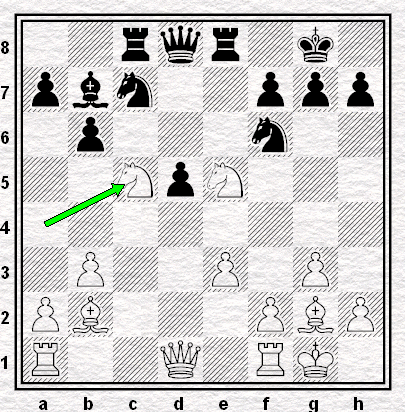

# Ronde 1. Polougaïevski - Lautier

**1. d4 Cf6 2. c4 e6 3. Cf3 b6 4. g3 Fa6 5. b3 Fb4+ 6. Fd2 Fe7 7. Fg2 d5 8. cxd5 exd5 9. Cc3 O-O 10. O-O Fb7 11. Ce5 Ca6 12. Fc1 c5 13. Fb2 Cc7 14. e3 Te8 15. dxc5 Fxc5 16. Ca4 Tc8 17. Cxc5**  
(`+0.56 Stockfish 6 5'`) **1/2-1/2**

  
**Diagramme 4** : Polougaïevski-Lautier, position finale  
`2rqr1k1/pbn2ppp/1p3n2/2NpN3/8/1P2P1P1/PB3PBP/R2Q1RK1 b - - 0 17`
