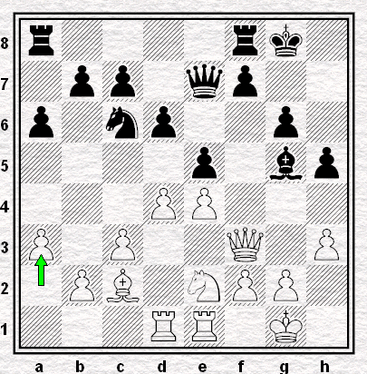

# Ronde 1. Wahls - Hort 

**1. e4 e5 2. Cf3 Cc6 3. Fb5 Cf6 4. d3**  

Ce coup inaugure un autre schéma de la Défense Berlinoise. Il est plus paisible, en ce sens que les Blancs n'ouvrent pas la colonne d et n'échangent pas les Dames afin d'empêcher les Noirs de roquer.  

**4...d6 5. O-O Fe7 6. c3 a6 7. Fa4 Fg4 8. Cbd2 Cd7 9. h3 Fh5 10. Te1 Cc5 11. Fc2 Ce6 12. Cf1 Cg5 13. Fxg5 Fxg5 14. Cg3 Fxf3 15. Dxf3 g6 16. Tad1 O-O 17. d4 De7 18. Ce2 h5 19. a3**  
(`+0.00 Stockfish 6 5'`) **1/2-1/2**

  
**Diagramme 5** : Wahls-Hort, position finale  
`r4rk1/1pp1qp2/p1np2p1/4p1bp/3PP3/P1P2Q1P/1PB1NPP1/3RR1K1 b - - 0 19`
