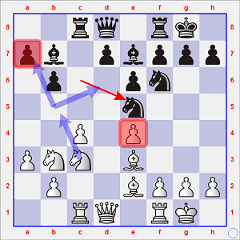
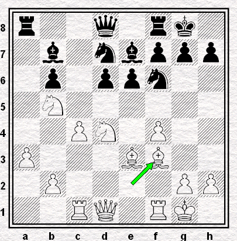
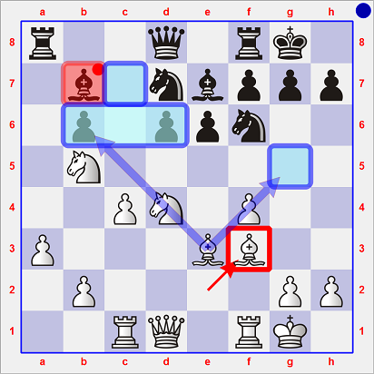
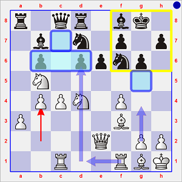
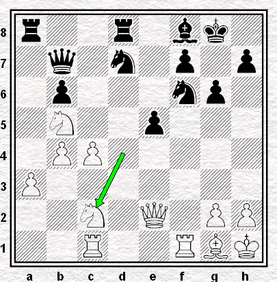
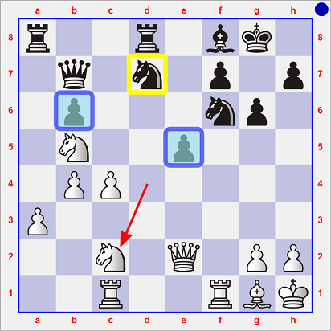
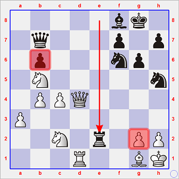
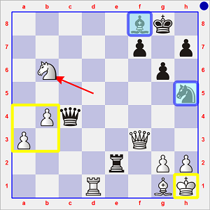

# Ronde 2. Andersson - Polougaïevski

**1. c4 c5 2. Cf3 Cc6 3. d4 cxd4 4. Cxd4 Cf6 5. Cc3 e6 6. a3**  
Une variante mise en vogue par le Britannique Speelman) 

**6... Fc5**  

Deux ans auparavant, une partie de haut niveau ayant opposé Jonathan [**SPEELMAN**](https://fr.wikipedia.org/wiki/Jonathan_Speelman) au Néerlandais Jan [**TIMMAN**](https://fr.wikipedia.org/wiki/Jan_Timman) avait continué par 6... d5 7. cxd5 exd5 8. Fg5 Fe7 9. e3 O-O 10. Fb5 et s'était terminée par la nulle (Coupe du Monde, Reykjavik, 1988, 1/2, 48.)

**7. Cb3 Fe7 8. e4 O-O 9. Fe2 b6 10. O-O Fb7 11. Fe3 Tc8 12. Tc1 Ce5**

`2rq1rk1/pb1pbppp/1p2pn2/4n3/2P1P3/PNN1B3/1P2BPPP/2RQ1RK1 w - - 6 13`

 (après 12... Ce5)

Ce coup est classique. Il incite les Blancs à jouer 13. f4, ce qui permet au Cavalier de se mettre en sécurité en g6. Ensuite, les Noirs continuent de préparer la poussée d7-d5 qui, en règle générale, leur fournit un jeu égal.  

L'idée d'Andersson est tout autre : abandonner le pion e4 pour s'en aller pêcher le pion a7.

Cela lui coûtera certes `3 tempi` (Cc3-b5 ; Cb5xa7 ; Ca7-b5), mais le Cavalier, une fois revenu en b5,

* fera pression sur la case faible au cœur du camp adverse : d6 ;
* soutiendra avec son collègue en b3 un groupe de trois pions blancs face l'`isolani` adverse en b6.

Andersson fait ainsi le pari que l'abandon du centre de sa part n'entraînera que gêne dans le camp opposé.

**13. Cb5 Cxe4 14. Cxa7 Ta8 15. Cb5**  

**15... d6** (`+0.11 Stockfish 6 30"`) première concession positionnelle du champion soviétique : la présence à terme d'un pion noir en d5 devient improbable ; 15... Cg6 dans l'idée de son coup précédent lui assurait peut-être un développement un peu plus *élastique*.

**16. C3d4**  
Un coup tel que 16. f3 gagnait certes un tempo sur le Ce4, mais en perdait un dans la perspective de l'avènement d'un pion en f4.

**16... Cf6** "*Svarts ställning är föga angenäm men Polu har ju faktiskt en majoritet pä kungsflygeln. Ett försök att utnyttja denna vore 16... Dd7 och eventuell f7-f5 (17. f4 Sg6)*" (Kjell KRANTZ in "*Tidskrift för Schak*" Nr 7-1990, page 288)  
[`traduction du suédois :` "La position des Noirs n'est pas très agréable, mais *Polu* dispose effectivement d'une majorité à l'aile-roi. Une tentative de l'exploiter serait 16... Dd7 suivi éventuellement de f7-f5 (si 17. f4 suit 17... Cg6)"]  

**17. f4 Ced7 18. Ff3**

   
**Diagramme 1** : Andersson-Polougaïevski, position après 18. Ff3  
`r2q1rk1/1b1nbppp/1p1ppn2/1N6/2PN1P2/P3BB2/1P4PP/2RQ1RK1 b - - 0 18`

Les Blancs dominent la position à l'aide de l'excellent positionnement de leurs pièces légères.  

De nombreuses cases du camp noir sont faibles.  

À court terme, le Fb7 est en prise =&gt; faut-il l'échanger ou le protéger ?  
Aucun des termes de cette alternative ne semble agréable :

* sur 18... Fxf3 19. Dxf3 permet à la Dame de dominer la grande diagonale, puis au Cd4 ou à la Dame de prendre pied ferme en c6 et dominer l'ensemble du camp noir ;
* certains coups de protection du Fou sont désastreux :
    * 18... Tb8 19. Fxb7 Txb7 20. Cc6 (`+1.46`), et la Tour et la Dame sont placés en dépit du bon sens ;
    * 18... Cc5 19. Fxb7 Cxb7 20. Cc6 (`+1.28`) et *idem*, mais cette fois pour le Cavalier et la Dame ; 
    * 18... Cc5 19. b4 Cce4 20 g4 (`+ 0.83`), et les Blancs dominent les débats.

Reste donc le très passif **18... Dc8** qui permet aux Blancs de maintenir la tension, c'est-à-dire de ne rien lâcher de leur emprise sur les cases marquées en bleu : **19. De2**.  
**19... Td8 20. Rh1**  
"Pourquoi se presser ?", se dit le patient Suédois. Ceci étant, 20. g4 lui aurait donné un avantage positionnel proche d'un pion (`+0.86`), selon l'ordinateur. 

Mais l'idée de cette retraite du Roi se révèle dès la coup suivant : **20... Ff8 21. Fg1**  

En effet, le Fou continue à pointer vers l'`isolani` b6, mais cette fois depuis sa tanière.  
**21... g6** (les Noirs, qui n'ont pas grand' chose à entreprendre, se construisent un `fianchetto`) **22. b4**

`r1qr1bk1/1b1n1p1p/1p1ppnp1/1N6/1PPN1P2/P4B2/4Q1PP/2R2RBK b - b3 0 22`

 (après 22. b4)

C'est vraiment un *summum* de massage positionnel !  
&Agrave; présent, g2-g4 menace réellement, coup qui serait suivi, au choix, d'un redéploiement des forces blanches vers le roque noir, ou alors de manœuvres le long de la colonne d.

Les Noirs ne savent plus ou donner de la tête : ils se résignent à abandonner leur `duo` pions centraux d6-e6.  
Qui sait ? Peut-être des possibilités tactiques se présenteront-elles ? Tout n'est-il pas préférable à continuer de subir la lancinante torture du Grand Maître scandinave sans bénéficier de la moindre perspective de `contre-jeu` ?

**22... e5 23. Fxb7 Dxb7 24. fxe5 dxe5 25. Cc2**  

La poussière s'étant dissipée, que reste-t-il de la domination blanche que les Noirs doivent encore combattre ?

   
**Diagramme 2** : Andersson-Polougaïevski, position après 25. Cc2  
`r2r1bk1/1q1n1p1p/1p3np1/1N2p3/1PP5/P7/2N1Q1PP/2R2RBK b - - 0 25`

Le pion b6 a vu ses trois adversaires s'avancer dangereusement, et le pion e5 a beau être un `pion passé`, il doit d'urgence être protégé par une pièce autre que le Cd7, car ce dernier menace d'être `surchargé` par sa double mission de veiller à tenir toute cette zone de l'échiquier.

---

 **Amener un deuxième défenseur au secours du pion e5 : arborescence :**

* soutien direct 25... Te8 
    * 26. Ce3 (`+0.40`) 
    * 26. Tcd1 (`+0.32`
* interposer une pièce 25... Ce4
    * 26. Ce3 (`+0.20`) 
    * 26. Tfd1 (`-0.20`)
* *Fianchetto* 25... Fg7 
    * 26. Ce3 (`+0.43`) 
    * 26. Cd6 (`+0.32`) 
    * 26. c5 (`+0.26`)
* permettre f7-f6 25... Ch5 
    * 26. Ce3 (`+0.00`) 
    * 26. Tcd1 (`+0.00`) 
    * 26. Df3 (`+0.00`)

---

L'ordinateur a la même évaluation que Lev Polougaïevski : **25... Ch5** semble une suite annulante.  
**26. Tcd1**

Encore faut-il ne pas céder aux mirages ...

Comme les deux Tours se font face sur la colonne d, le Russe se dit qu'il pourrait les échanger. Pour lui, le sacrifice de son pion e n'est pas grave, car il se dit que les Blancs ne sont pas suffisamment coordonnés pour percer à l'Aile Dame, ou pour s'en prendre à son Roi.  

**26... Cdf6 27. Dxe5 Txd1 28. Txd1 Te8 29. Dd4 Te2**

`5bk1/1q3p1p/1p3np1/1N5n/1PPQ4/P7/2N1r1PP/3R2BK w - - 3 30`

 (après 29... Te2)

Voilà le mirage et la ressource offensive qu'escomptait Polougaïevski : une attaque de mat sur g2.  

Mais il a oublié que les Blancs peuvent se défendre, puis continuer à accroître leur pression sur b6, ce qui - il devrait le savoir - est leur idée fixe au vu l'absence initiale du pion c (`A33 English Symmetrical Variation 1. c4 c5`) et de la disparition de son pion a7 au quatorzième coup.

**30. Ce3 Ce4 31. Cc3 Cxc3 32. Dxc3 De7 33. Cd5**  
Cette fois, le pion b6 tombe.  
**33... De4**  
Toujours cette menace de mat qui n'en est pas vraiment une.  
**34. Df3 Dxc4**  
Sur 34... Dxf3 35. gxf3 et le pion b tombe.  
**35. Cxb6**

 (après 35. Cxb6)

La position noire est en ruines : les Blancs ont deux `pions passés` éloignés, leur Roi est en totale sécurité et les pièces légères noires sont en périphérie. En outre, les Noirs ont un pion en moins depuis le désastreux 26... Cdf6, joué alors que la nulle était en vue.

La fin de la partie n'est plus qu'agonie.  
**35... De6 36. Cd5 Fd6 37. g4 Cf4 38. Cxf4 Fxf4 39. Tf1 g5 40. Ff2 Ta2 41. Fg3 Da6 42. Fxf3 Txa3 43. Fe3 1-0**.
