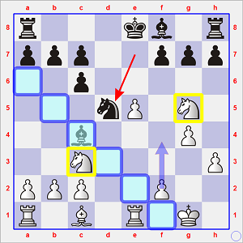

# Ronde 2. De Firmian - Miles

**1. e4 e5 2. Cf3 Cc6 3. Fb5 Cf6 4. O-O Cxe4 5. d4 Cd6 6. Fxc6 dxc6 7. dxe5 Cf5 8. Dxd8+ Rxd8 9. Cc3 Re8**

Ces premiers coups ont été commentés dans la partie [**Karpov - Miles**](01_Karpov_Miles.md) de la [première ronde](Ronde_01.md).  
Dans le contexte de 10. b3, Miles n'avait jamais cru bon de placer son Fou de cases blanches en avant du pion e5. Ce Fou s'était ensuite retrouvé loin du lieu du combat au moment essentiel de celui-ci.  
=&gt; Quand le jeune Américain lui joue **10. h3** (coup destiné à chasser ensuite le Cavalier), il prend cette fois bien soin d'installer "correctement" (du moins, comme le préconise la `tabiya` de l'Ouverture `C67`) son Fou de cases claires.  

**10... Fe6 11. g4 Ce7 12. Cg5**  
Chatouille le Fou et point vers le point faible f7.  
**12... Fc4** 
Reste sur la diagonale du pion f7 et chatouille à son tour une pièce blanche.  
**13. Te1**  
13. Td1 est également dans l'esprit de la *Berlinoise*.  
**13... Cd5**

`r3kb1r/ppp2ppp/2p5/3nP1N1/2b3P1/2N4P/PPP2P2/R1B1R1K1 w - - 5 14`

 (après 13... Cd5)

Les Blancs auraient une position plutôt avantageuse s'ils parvenaient à jouer f2-f4, ce qui leur donnerait par la suite le choix entre plusieurs types de `duos` (e5-f5 ou g4-h4) avant d'entrer en contact avec les pions noirs de l'Aile Roi.  

Cependant, les pions blancs ne peuvent pas s'avancer en rase campagne, sans être soutenu "de l'arrière" par un nombre suffisant de pièces légères.  

Si les Blancs n'ont pas de souci avec le Fc1, il est par contre évident que le Cg5 sera bientôt chassé, soit par Ff8-e7, soit plus vraisemblablement par h7-h6.  
Quant au Cc3, au moment d'envisager un périple en direction des pions orientaux, qu'il prenne bien soin d'éviter les cases blanches, car (autre thème de la partie [Karpov-Miles](01_Karpov_Miles.md)), dans une *Berlinoise* les Noirs sont les maîtres absolus des cases blanches.

Le cheminement choisi par De Firmian commence donc par **14. Cd1** et le déroulement de la partie est conforme à ce qui vient d'être énoncé.  

**14... h6 15. Ce4 Cb4**  
Menace de prendre en c2.  
**16. Ce3 Fd5 17. Cg3 Fe6 18. a3 Cd5 19. Cg2 a6 20. f4**  
Mission accomplie à l'Aile Roi pour les Blancs !  
**20... Fc5+ 21. Rh2**

---

   
**Diagramme 3** : De Firmian-Miles, position après 21. Rh2  
`r3k2r/1pp2pp1/p1p1b2p/2bnP3/5PP1/P5NP/1PP3NK/R1B1R3 b kq - 0 21`

Les Blancs ont tiré tout ce qu'ils pouvaient de la position. Au sortir de l'ouverture, ils disposent d'une majorité à l'Aile Roi parfaitement en ordre de bataille, soutenue par des pièces en nombre suffisant, et leur Roi est en sécurité.  

Les Noirs disposent de la `paire de Fous`, mais l'efficacité de celle-ci serait fortement réduite si les Blancs jouaient b2-b4 et achevaient de placer leurs pions sur des cases blanches *via* f4-f5 ; le Cavalier est venu (13° coup), puis revenu (au 18°) sur la case d5, mais c2-c4 menace de le déloger ; enfin, le Roi devra encore gaspiller un `tempo` afin de faire de la place et mettre en jeu au moins l'une de ses Tours.

Pour ces raisons, l'évaluation immédiate (30") de la position est `+0.53` ; elle est portée à `+0.58` après 10 minutes. La meilleure suite envisagée par `Stockfish 6` consiste à éliminer le Cg3 à l'aide du Fou de cases noires *via* 21... Ff2 22. Tf1 Fxg3+ 23. Rxg3, puis à chercher, soit à dynamiter la structure blanche par 23... f5, soit, plus prudemment, à contenir les avancées adverses en jouant 23... g6 (voir ce diagramme d'analyse ci-dessus à droite).

On peut se douter qu'en féru de la *Berlinoise*, Anthony Miles était de longue date un familier de cette position et qu'il avait (à l'époque sans l'assistance d'un ordinateur) dû travailler à domicile à rendre la position plus agréable du point de vue des Noirs. Comment entraver la progression de la chaîne de pions blancs ? Comment la désolidariser ? Ou même comment la paralyser ?  

Il donne à voir le résultat de ses cogitations face à un adversaire sans doute moins affûté que Karpov ne l'était à la ronde précédente.

---

Miles a concocté un dispositif à deux branches :

1. un sacrifice de pion : **21... h5 22. Cxh5**
2. la soustraction du Roi au `clouage` de la Tour blanche : **22... Rf8**

Analysons le résultat de ces mesures radicales.  

Le fait est que la fluidité de la structure de pions est à présent inéluctablement compromise.

   
 

* en haut à gauche : sur h3-h4, le Fou récupère le pion g4, puis ne fait qu'une bouchée du Ch5 et/ou du pion h ;
* en haut à droite : g4-g5 est impossible, à peine de perdre le Cavalier, puis le pion h3 ;
* en bas à gauche : si le pion f avance, le Fou s'en empare sans autre forme de procès, et sur gxf5 suit Txh5 ;
* en bas à droite : si le Cavalier perd un `tempo` en revenant en g3, il suit Fxg4, puisque le pion h3 est cloué.

 

* ci-dessus à gauche : de plus, et c'est l'effet du second élément du dispositif imaginé par Miles, puisque le Fou ne serait plus cloué en cas d'échange faisant passer le pion e sur la colonne f, les Noirs peuvent envisager l'échange de leur pion faible f7 contre l'avant-poste adverse au moyen de 23... f6; en effet, sur 24. exf6, il y aurait 24... Cxf6 ;
* ci-dessus à droite : l'autre menace est 23... Fxg4, car sur 24. hxg4, il y a 24... g6 qui regagne le Cavalier cloué avec un jeu agréable pour les Noirs.

De Firmian reste songeur - on le serait à moins.  
Il estime que le plus important, c'est, pour lui également, de soustraire son Roi au clouage adverse, ce qui l'incite à jouer **23. Rg3**.  

L'un des grands apports de l'ordinateur est qu'il ne craint pas les complications : il estime donc qu'il faut, pour maintenir du dynamisme à la position, désorganiser le camp adverse par 24. c4 et ainsi conserver l'initiative. Mais après 24... Cb6, il faut tout de même soutenir le pion c4 par 25. b3, ce qui permet aux Noirs de contre-attaquer 25... g6 26. Cf6 Td8 avec une plongée possible de la Tour sur la case (à nouveau "*blanche*") d3.

Toujours est-il que le coup qu'a choisi le jeune Américain a évaporé l'initiative blanche :  
**23... g6 24. Cf6 Cxf6 25. exf6 Fd4 26. f5**  
Si 26. g5 =&gt; 26... Txh3#  

**26... gxf5 27. g5 Tg8 28. Rh2 Fd5 29. h4 Fxf6 30. c4**  
Si 30. gxf6 =&gt; 30... Txg2+ gagne le pion c2.

**30... Ff3 31. Te3 Fxg2 32. Rxg2 Fd4 33. Td3 c5**

`r4kr1/1pp2p2/p7/2p2pP1/2Pb3P/P2R4/1P4K1/R1B5 w - - 0 34`

 (après 33... c5)

Le milieu de partie touche à son terme.  

Ce sont les Noirs qui ont un pion de plus, mais, privé du soutien du Fou de cases blanches, f5 n'a aucun avenir.  

Miles est néanmoins arrivé à ses fins : annihiler la force de frappe adverse qui écrasait l'Aile Roi.  
Les pions g et h sont encore liés, mais ils ont à peine franchi l'`équateur`.

La partie s'achève sur quelques dernières escarmouches :  
**34. Fe3 Fxe3 35. Txe3 Td8 36. Tf1 Td4**  
**37. Txf5 Txc4**  
Nettement moins aigu était 37... Txh4.  
**38. h5 Tg4+ 39. Tg3 Txg3+**  
&Agrave; nouveau, 39... Th4 clôt les débats.  
**40. Rxg3 b6 41. g6**  
41. h6 aurait pu quelque peu les prolonger.  
**41... Tg7 42. Rf4 Rg8 43. Rg5 fxg6 44. hxg6 Td7 45. Rh6 Td2 46. Tf7 Th2+ 47. Rg5 Tg2+**  

`échec perpétuel` =&gt; **1/2-1/2**

