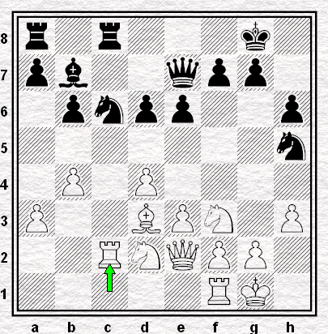

# Ronde 2. Hort - Karpov

**1. d4 Cf6 2. Cf3 e6 3. Fg5 h6 4. Fh4 b6 5. e3 Fb7 6. Cbd2 Fe7 7. c3 c5 8. h3 O-O 9. Fd3 cxd4 10. cxd4 Cc6 11. a3 Ch5 12. Fxe7 Dxe7 13. O-O Tfc8 14. Tc1 Ca5 15. De2 d6 16. b4 Cc6 17. Tc2**  
(`+0.25 Stockfish 6 5'`) **1/2-1/2**

  
**Diagramme 4** : Hort-Karpov, position finale  
`r1r3k1/pb2qpp1/1pnpp2p/7n/1P1P4/P2BPN1P/2RNQPP1/5RK1 b - - 2 17`

