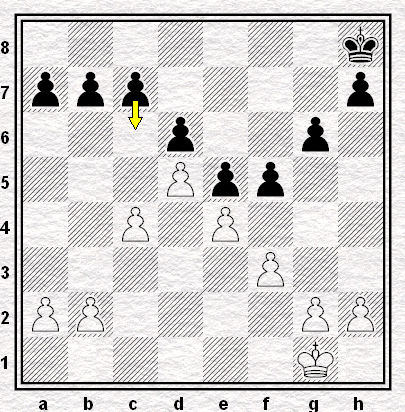
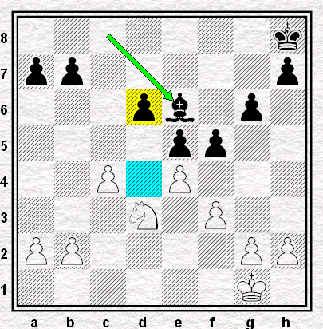
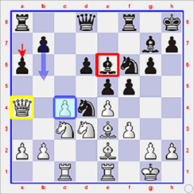
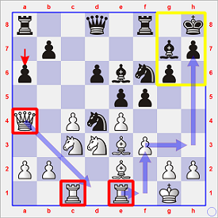
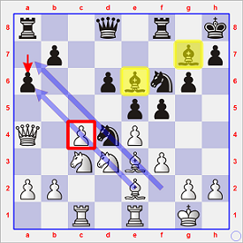
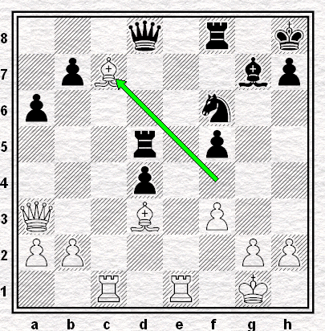
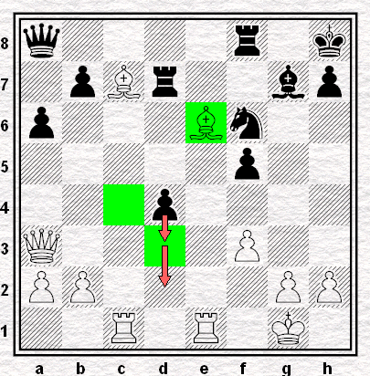

# Ronde 2. Lautier - Wahls

**1. d4 Cf6 2. c4 g6 3. Cc3 Fg7 4. e4 d6 5. Fe2 O-O 6. Cf3 e5 7. O-O Cc6 8. d5 Ce7 9. Ce1 Cd7 10. Cd3 f5 11. Fd2 Cf6 12. f3 Rh8 13. Tc1 c6**  

Le **Diagramme 5** (ci-dessous, à gauche) montre qu'il s'agit jusqu'à présent d'une *Est-Indienne* (`E99. King's Indian`) traditionnelle pour ce qui est du déploiement des pions : les Blancs ont franchi l'`équateur` au centre de l'échiquier, mais les Noirs disposent en contrepartie d'un jeu solide à l'Aile Roi à l'aide du `duo` e5-f5. 

Tout aussi traditionnellement, comme l'essentiel de leur développement initial s'est déroulé sans encombre, les Noirs songent les premiers à rompre l'équilibre en questionnant le pion d5 au moyen du coup c7-c6. Les Blancs ont alors l'embarras du choix :

* **(a)** ils laissent prendre leur pion, et
    * **(a1)** reprennent par c4xd5, ou
    * **(a2)** reprennent par e4xd5, ou encore
    * **(a3)** reprennent en d5 à l'aide du Cc3
* **(b)** ils échangent leur pion d contre le pion c6, ce qui laisse le choix aux Noirs
    * **(b1)** de reprendre le pion par b7xc6 ;
    * **(b2)** de reprendre le pion à l'aide de Ce7.

Ce qui nous préfigure cinq *aires géographiques* distinctes, et autant de manières différentes d'aborder le `milieu de partie` dans l'*Est-Indienne*.  

Question de goût, donc, pour Lautier qui emprunte l'embranchement **(b)** et pour le jeune Allemand, lequel opte pour **(b2)**.  

**14.dxc6 Cxc6 15.Fe3 Fe6** (voir le **Diagramme 6**, ci-dessous à droite)

   
**Diagrammes 5 et 6** : Lautier-Wahls, structures de pions après 13 et 15 coups.

En limitant toujours l'examen de la position à la topographie offerte par les pions, on constate que le pion d6 devra sans doute demeurer un objet particulier d'attention pour les Noirs, car il risque de rester longtemps `arriéré`, tant l'accès à la case d5 est verrouillé par les Blancs. 

En contrepartie, la case d4 constitue un `trou` dans la position blanche, et les Noirs gagneraient avantage à y loger un Cavalier (dans l'*Est-Indienne*, l'horizon du Fou de cases noires déployé en g7 est bouché par son propre pion e5), toute la question étant de savoir si les Blancs toléreront longtemps un tel maraudeur convoitant ostensiblement leur arrière-garde depuis la vue panoramique qui s'offre en d4.

**16. Da4**  

Surprise : alors que 16. b3 reconstituait une chaîne de pions à peu de frais, c'est la Dame qui prend l'air *à l'ouest*, alors qu'on ne saisit pas très bien qu'elle pourrait être son objectif d'attaque. Tout juste les Blancs peuvent-ils espérer faire en sorte que la Tour noire de l'Aile Dame reste à demeure dans son coin plutôt que de faire pression, comme attendu, le long de la colonne c.

**16... Cd4**  
*Quo usque tandem?* ce Cavalier abusera-t-il de sa position avantageuse, en effet...  

**17. Tfe1**  
En tout cas, rien ne presse, selon le Français.  

**17... a6**  
Délivrons donc la Tour de la garde du pion a, et montrons à l'adversaire que Dd1-a4 était superfétatoire, semble se dire Matthias Wahls.

On pourrait encore continuer longtemps à ne pas représenter la position par diagrammes et à décrire de loin et de façon sommaire les arabesques de ces quelque trente pièces encore à l'œuvre sur l'échiquier.  

Comme l'indique Simon **WILLIAMS** (Angleterre) dans ses brèves vidéos sur *Youtube* qui vulgarisent les défenses praticables sans grand effort de mémorisation pour les Noirs, telles que la *Pirc* (`1. e4 d6`) ou que l'*Est-Indienne*, le fait est que le développement des deux camps s'y avère en général tellement lent, harmonieux et sans surprise que ne s'y esquissent que très rarement des combinaisons tactiques, échanges de pions ou de pièces susceptibles de marquer une inflexion dans les intentions stratégiques des protagonistes. Comme les pions se frottent mais ne viennent pas vraiment au contact, "même une mazette peut tenir aisément pendant 20 coups contre un Grand Maître dans une ouverture telle que la Pirc ou l'Indienne du Roi" : voilà une phrase à peine imaginaire tant elle saisit pour l'essentiel cette opinion de Simon Williams sur ce genre d'ouverture.

> Le chroniqueur de www.chess24.com Jan **GUSTAFSSON** (Allemagne) renchérit : "*More often the struggle is sort of positional, and slow, and there... To my mind you need a lot of experience or you need to gain a lot of experience and not so much studying to become a good King's Indian player.* [...] *You're not gonna get crushed out of the opening in some theoretical lines but you are giving up a lot of space and you have to be comfortable with that.* [...] *I think you can play the King's Indian if you have a good feel for the positions without knowing all that much theory.* [...] [Concerning your being ready for all possible move orders and move order trickery:] *you don't have that worry with the King's Indian.*"  

Leçon "[*Jan's Opening Clinic 7. 1.d4 edition*](https://www.youtube.com/watch?v=LK-nrtHUcPQ)" tournée en juillet 2015 (à réécouter à partir de 34')

Cessons cependant ici le jeu de pistes, pour en revenir à un commentaire de partie plus conventionnel.

---

Les trois graphiques ci-dessous montrent donc la position telle qu'elle se présente au regard des Blancs avant leur dix-huitième coup.  

`r2q1r1k/1p4bp/p2pbnp1/4pp2/Q1PnP3/2NNBP2/PP2B1PP/2R1R1K1 w - - 0 18`

  

* à gauche : le point de vue pessimiste des choses ...
    * Un coup tel que 18... b5 constitue une réelle menace pour tout le *set-up* des Blancs sur l'Aile Dame : sur b7-b5, le pion c4 subira en effet `2 attaques` (pion b5 et Fe6) alors qu'il n'est défendu que par la Dame, et après 19. cxb5 axb5, la Dame sera contrainte de se replier sur d1, le pion a2 subira l'attaque conjointe du Fe6 et de la Ta8, et la percée ultérieure b5-b4 pourrait être préparée par un (des) coup(s) tel(s) que Ta8-b8 et/ou Dd8-a5.
    * Le coup 18. b3 qu'il aurait importé de jouer au seizième coup ne préviendrait pas 18... b5, mais après 19. cxb5 axb5, la Dame n'aurait alors eu que la case b4 pour se replier. L'ordinateur voit ensuite 20... fxe4 21. fxe4 Tb8 (`-0.81 Stockfish_14053109_32bit 10 minutes`) comme continuation virtuelle.
    * Protéger le pion c4 à l'aide du Fou e2 est sans doute la meilleure parade contre la menace 18... b5, mais la suite de la partie ne paraît poser aucun problème pratique aux Noirs : 18. Cf2 b5 19. cxb5 et les Noirs ont le choix entre plusieurs continuations aisément gérables : 19... fxe4 (`-0.35`), 19... axb5, (`-0.26`), 19... Cxe2+ (`-0.09`) et même la poussée centrale *idéale* pour aboutir à une égalisation dans l'*Est-Indienne* : 19... d5 (`
-0.01`)

* au centre et à droite : le point de vue optimiste ...
    * Les Noirs brandissent cette menace b7-b5, certes, mais, d'une part, l'exécution de celle-ci dépend de la capacité de leur Cavalier à se maintenir en d4 pour *donner la main* à ce pion b, et, d'autre part, les Blancs peuvent se rassurer en se disant que c'est à eux de jouer et qu'ils ont dès lors leur mot à dire !
    * Par ailleurs, même si le commentaire ne l'a pas souligné, au cours des 17 premiers coups, les troupes blanches ont tout de même accompli de très bonnes choses. En particulier, Joël Lautier a pu concentrer toutes ses pièces (à l'exception notoire de la Dame) au centre de l'échiquier.  
    * Les Tours sont à pied-d'&oelig;uvre et n'attendent plus que l'**ouverture des colonnes**. Ainsi, la colonne f est tout de même la voie à privilégier pour espérer accéder au Roi noir ; et si les pions f s'échangeaient sur la case e4, la case f3 pourrait même se transformer en point de transit vers la colonne h.

Mais cette idée de transfert massif des pièces lourdes blanches vers l'autre extrémité de l'échiquier que montrent les flèches du diagramme central ci-dessus, c'est peut-être un peu trop prendre ses rêves pour des réalités, car - tout de même! - rien ne pousse les Noirs à jouer les premiers f5xe4.

Par contre, l'**ouverture des diagonales** pour les Fous blancs (diagramme de droite, ci-dessus), tout en maintenant fermées celles dont disposent les Fous noirs, voilà qui semble tout à fait envisageable, du moins dès le moment où le Cd4 disparaîtrait de leur horizon.  

Ainsi, si les Blancs jouaient ici 18. exf5 et si les Noirs reprenaient par 18... Cxf5, il suffirait de jouer 19. Ff2 pour que les Fous, sans plus être `en prise`, dominent les diagonales a7-f1 et a6-e1 - dissuadant sans doute ainsi les Noirs d'effectuer la poussée b7-b5.  

Dans ce cas de figure, le Fe6 continuerait à mordre sur le granit du pion c4 et le Fg7 ne se départirait pas de son rôle défensif "Est-Indien" usuel. *De facto*, les Noirs devraient alors se mouvoir dans un espace réduit, situé en arrière des pions d6-e5-f5-g6-h7, y attendre et défendre, tout en espérant que les Blancs n'abîment pas trop cette casemate.

Cette dernière vision des choses est bien entendu optimiste, en ce sens que rien n'oblige les Noirs à reprendre avec le Cavalier en cas de 18. exf5.  

La réponse 18... Fxf5 est jugée `-0.13` par l'ordinateur, c'est-à-dire incertaine, sans doute égale, peut-être légèrement en faveur des Noirs. Il existe une notation pour rendre compte de ce genre d'évaluation, c'est &infin;, le sigle mathématique qui désigne l'infini, mais aussi quelquefois l'indétermination, l'incertitude, le champ de tous les possibles, etc. 

C'est que, à partir d'ici, les Blancs peuvent en effet se lancer dans des plans aussi *polymorphes* que 

* 19. Cb4 (`-0.06`)
* 19. Dd1 (`-0.08`)
* 19. Cf2 (`-0.12`)
* 19. Ff1 (`-0.17`)

---

Le lecteur comprendra sans doute mieux pourquoi il s'avère si difficile de commenter une partie qui résulte d'une ouverture telle que l'*Est-Indienne* en fournissant des variantes concrètes.  

Le regard plus ou moins optimiste que pose joueur ayant le trait est susceptible d'y métamorphoser à tout instant les contours du combat.  

Si cette ouverture est simple à apprendre et si les défaites rapides n'y sont pas à redouter, elle génère **un environnement où la subjectivité** de chaque joueur se révèle et fait loi.

---

En l'occurrence, en ce beau jour de juillet 1990, Joël Lautier semble plutôt d'humeur pessimiste, car il se décide pour **18. c5** destiné à prendre `en passant` le pion qui s'avancerait en b5. Ce faisant, il offre sutout à son adversaire l'opportunité de se débarrasser de son `pion faible` d6 et de disposer pour ses pièces lourdes de la colonne d.

Et c'est ce qui arrive après **18... Tc8 19. Da3**  
Et pourquoi pas 19. cxd6 ? Et pourquoi pas 19. exf5 ?  
**19... Fc4 20. cxd6 Fxd3 21. Fxd3 Tc6 22. exf5**  
**22... gxf5**  
22... Txd6 était plus sûr, mais les Noirs ne veulent pas que les pions blancs démantèlent leur roque.

**23. Ce2** (*Quo usque tandem? ...*)  
**23... Txd6 24. cxd4 exd4 25. Ff4 Td5 26. Fc7**

  
**Diagramme 7** : Lautier-Wahls, position après 26. Fc7  
`3q1r1k/1pB3bp/p4n2/3r1p2/3p4/Q2B1P2/PP4PP/2R1R1K1 b - - 0 26`

Confiez cette position à l'ordinateur, et il se sentira très à l'aise du point de vue des Blancs (qui ont dû avoir raison d'avoir été plutôt pessimistes) : `+2.00` après 12 minutes ; le fait est que défendre les trois pions isolés (d4 et f5) ou arriéré (b7) ne semble pas évident, mais de là à accorder deux pions "secs" d'avance aux Blancs, il y a un pas que la fin de partie va cruellement démentir.

**26... Da8**  
Ce coup, qui empêche Te1-e7 d'avoir des effets négatifs, est également le préféré de *Stockfish*)

**27. Fc4 Td7 28. Fe6**

  
**Diagramme 8** : Lautier-Wahls, position après 28... Fe6  
`q4r1k/1pBr2bp/p3Bn2/5p2/3p4/Q4P2/PP4PP/2R1R1K1 b - - 0 28`

Seulement deux coups séparent le **Diagramme 7** du **Diagramme 8**.  
Pourtant, il semblerait bien que, devenu soudainement optimiste, Joël Lautier ne se soit soudainement complètement fourvoyé : s'il y avait bien un pion à tenir sous l'éteignoir parmi b7, d4 et f5, c'était évidemment le `pion passé` sur lequel les Noirs s'étaient arc-boutés depuis le fameux c4-c5 joué par les Blancs à la croisée des chemins du dix-huitième coup. Or, le Fou d3 s'en est allé courser la Tour en croyant que `gagner la qualité` (= échange d'un Fou contre la Td7) lui assure un gain facile.

Et donc, c'est avec **28... d3** que prend cours le contre-jeu noir.  
Pourtant, l'ordinateur continue à cet endroit à toujours le considérer comme insuffisant.  

**29. Ted1**  
29. Fxd7 d2 30. Fxf5 Cd5 (où les Fc7, Ff5, Tc1 et Te1 sont `en prise` est la suite préconisée par l'ordinateur, avec toujours une évaluation aux alentours de `+2`

**29... d2** gagne à présent, car tout ce passe comme si l'aiguille de la boussole de *Stockfish* s'était retournée : 30. Tc2 (`-2.10`) De8 (`-2.17`) 31. Db3 (`-2.22`) Te7 (`-2.05`) 32. Tcxd2 (`-2.15`) et 32... Txc7 (`-2.10`) ou 32... Txe6 (`-2.09`)

**30. Tc2 Te8 31. Db3 Tde7 32. Tcxd2 Txe6 33. Td8 Da7+ 34. Rf1 De3 35. Dxb7 Txd8 36. Txd8+ Ce8 37. Fa6 Dc1+ 38. Rf2 Dc5+ 0-1**

Une bien étrange partie en vérité, où la nature du combat a comme semblé suivre avec un léger décalage temporel l'évolution des états d'âme du champion français.
