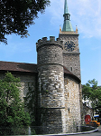
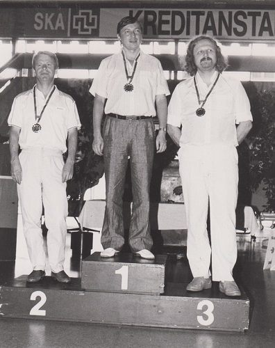

# Bienne 1990

 ")  
  
Le Festival de Bienne a lieu chaque année [depuis 1968](https://en.wikipedia.org/wiki/Biel_Chess_Festival). Il fut scindé en deux (GMI et Masters) à partir de 1976.  
En 1990, le tournoi des GMI fut disputé en doubles rondes entre 8 GMI.  

| Participants | **Elo** |
| ---: | --- |
| Anatoli [**KARPOV**](https://fr.wikipedia.org/wiki/Anatoli_Karpov)  | 2730 |
| Ulf [**ANDERSSON**](https://fr.wikipedia.org/wiki/Ulf_Andersson)  | 2630 |
| Lev [**POLOUGAIEVSKI**](https://fr.wikipedia.org/wiki/Lev_Polouga%C3%AFevski)  | 2610 |
| Anthony [**MILES**](https://fr.wikipedia.org/wiki/Tony_Miles)  | 2595 |
| Joël [**LAUTIER**](https://fr.wikipedia.org/wiki/Jo%C3%ABl_Lautier)  | 2570 |
| Nick [**DE FIRMIAN**](https://fr.wikipedia.org/wiki/Nick_de_Firmian)  | 2560 |
| Vlastimil [**HORT**](https://fr.wikipedia.org/wiki/Vlastimil_Hort)  | 2545 |
| Matthias [**WAHLS**](https://en.wikipedia.org/wiki/Matthias_Wahls)  | 2525 |

Ce fut la première participation d'Anatoli KARPOV, peu avant son cinquième et dernier match homérique contre Kasparov.  

La moyenne Elo des concurrents étant comprise entre 2575 et 2600, ce Tournoi atteignit donc la Catégorie XIV.  

  
( *le podium, avec de gauche à droite Andersson, Karpov et Miles* )  

La [**Ronde 1**](Ronde_01.md) ne connut qu'une seule partie décisive, où la patte magistrale de Karpov fit d'entrée  merveille face à une Espagnole, [Défense de Berlin](Berlin_wall.md), dix ans avant que le match Kasparov-Kramnik ne lui fasse connaître son heure de gloire.  
  
La [**Ronde 2**](Ronde_02.md) permit à Andersson, plus maître de son jeu positionnel que jamais, ainsi qu'au jeune Allemand Matthias Wahls de rejoindre Karpov dans le peloton de tête, ce dernier ayant rapidement annulé avec les Noirs contre Hort.  
  
Nouvelle démonstration de force de la part de Karpov dans la **Ronde 3**. Sa victime fut cette fois Joël Lautier qu'il accula à une finale sans espoir. Miles craqua lui aussi après soixante coups dans une partie jouée jusque là au cordeau contre Hort. Au classement général, Karpov s'isolait donc à nouveau, cette fois vis-à-vis du trio Andersson, Hort et de l'étonnant Wahls.  
  
Après une **Ronde 4** plutôt pacifique, qui se solda par quatre nulles, la **Ronde 5** permit à Karpov (dont la manœuvre Da4-d1 suivie du coup de pion a2-a4 fut une pure merveille d'étranglement stratégique face à Polougaïevski) de se détacher encore davantage, avec désormais un point entier d'avance sur le reste de la troupe.  

La **Ronde 6** marqua le réveil de Miles, auteur jusqu'alors d'un tournoi modeste. Dans la **Ronde 7**, il enfonça le clou contre Wahls alors que Karpov, avec 4 victoires et 3 nulles jusque là, virait à mi-parcours avec un point et demi d'avance sur son plus proche compétiteur.

