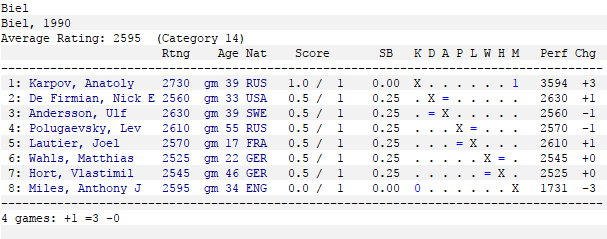

# Bienne 1990 - Ronde 1

> Vendredi 20 juillet 1990

## La Ronde 1 en un coup d'œil

| Blancs | Noirs | &nbsp; | Ouvertures |
| ---: | :--- | --- | :--- |
| Ulf Andersson | Nick De Firmian | 1/2 (49.) | A08. Reti Opening (King's Indian Attack) |
| Anatoli **Karpov** | Anthony Miles | 1-0 (42.) | C67. Ruy Lopez Berlin Defence Open Variation |
| Lev Polougaïevski | Joël Lautier | 1/2 (17.) | E15. Queen's Indian Nimzovich Variation (Exaggerated Fianchetto) |
| Matthias Wahls | Vlastimil Hort | 1/2 (19.) | C65. Ruy Lopez Berlin Defence |

 **Classement :**

 **1.** Karpov 1,0 Pt  
**3.** Andersson, De Firmian, Hort, Lautier, Polougaïevski et Wahls 0,5 Pt  
**8.** Miles 0,0 Pt

## Analyses

* [Andersson - De Firmian](01_Andersson_DeFirmian.md)
* [Karpov - Miles](01_Karpov_Miles.md)
* [Polougaïevski - Lautier](01_Polougaievski_Lautier.md)
* [Wahls - Hort](01_Wahls_Hort.md)

