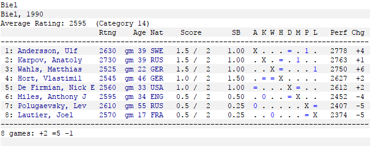

# Bienne 1990 - Ronde 2

> Samedi 21 juillet 1990

## La Ronde 2 en un coup d'œil

| Blancs | Noirs | &nbsp; | Ouvertures |
| ---: | :--- | --- | :--- |
| **Andersson** | Polougaïevski | 1-0 (43.) | A33. English Symmetrical Variation |
| De Firmian | Miles | 1/2 (47.) | C67. Ruy Lopez Berlin Defence Open Variation |
| Hort | Karpov | 1/2 (17.) | A46. Queen's Pawn Torre Attack |
| Lautier | **Wahls** | 0-1 (38.) | E99. King's Indian (5.Be2) |

 **Classement :**

 **1.** Andersson, Karpov et Wahls 1,5 Pt  
**3.** De Firmian et Hort 1,0 Pt  
**6.** Lautier, Miles et Polougaïevski 0,5 Pt

## Analyses

* [Andersson - Polougaïevski](02_Andersson_Polougaievski.md)
* [De Firmian - Miles](02_DeFirmian_Miles.md)
* [Hort - Karpov](02_Hort_Karpov.md)
* [Lautier - Wahls](02_Lautier_Wahls.md)

