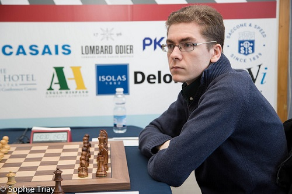
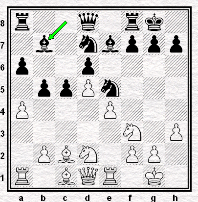
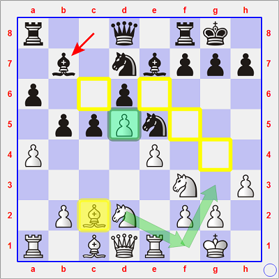
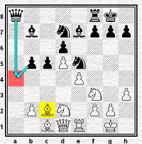
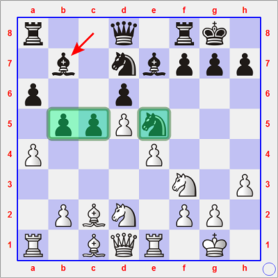

## Deux directions après une récitation de 15 coups

Lors du *Tradewise Gibraltar Masters* 2017, l'Espagnol David [**ANTON**][1] (`Elo 2650` - le 25ème de ce Tournoi *Open*) a réalisé une performance de choix. Au terme de neuf des dix Rondes, il s'était même acquis un demi-point d'avance sur tout le monde. Rejoint néanmoins sur le fil par le Chinois Yangyi [**YU**][2] et l'Américain Hikaru [**NAKAMURA**][3], il céda le prix de la première place en parties semi-rapides lors du départage. Néanmoins, son *prize money* de 16.000 £ lui fut sans doute très apprécié.

  
**David Anton**

Pour se hisser au pinacle, il sut vaincre avec les Noirs en l'espace de trois jours, les 29.01.2017 contre le très expérimenté `GMI` israélien Emil [**SUTOVSKY**][4] et le 01.02.2017 contre l'ex-Champion du Monde `FIDE` (2005-2006), le Bulgare Veselin [**TOPALOV**][5], pourtant bien expérimentés. &Agrave; chaque fois, il joua les quinze mêmes premiers coups :

**1. e4 e5 2. Cf3 Cc6 3. Fb5 a6 4. Fa4 Cf6 5. O-O Fe7 6. Te1 b5 7. Fb3 d6 8. c3 O-O 9. h3 Ca5 10. Fc2 c5 11. d4 Cd7 12. Cbd2 exd4 13. cxd4 Cc6 14. d5 Cce5 15. a4 Fb7**

`r2q1rk1/1b1nbppp/p2p4/1ppPn3/P3P3/5N1P/1PBN1PP1/R1BQR1K1 w - - 1 16`

Que dire de cette position ?

Tout d'abord du point de vue des Blancs.

> Il faut bien commencer par cela, puisque si Anton avait récité cette variante, c'est sans doute parce qu'il avait dû estimaer *a priori* que la position en résultant ne présentait pour lui aucun danger sérieux.

| Point de vue des ordinateurs | &nbsp; |
| --- | --- |
| Jugement du coup 15... Fb7 par `Stockfish 6 10'` | `+ 0.08` |
| Jugement du meilleur 16ème coup par `Stockfish_14053109_32bit 20'` | `+ 0.06` |

### Points forts des Blancs

De fait, les Blancs ne semblent disposer que d'un seul véritable atout maître dans cette posiion : le pion d5.

Bien soutenu par le pion e4, il restreint en effet le jeu des Noirs sur les cases blanches. Après la man&oelig;uvre Cd2-f1-g3 (ou Cd2-f1-e3, voire Cd2-f1-h2-g4), les Blancs semblent à même de resserrer l'étreinte sur les cases f5 et/ou h5.

> Ce plan est cependant assez lent car il coûte `2 tempi` qui pouraient être mieux utilisés.

### Points faibles des Blancs

&Agrave; côté de cela, le Fou de cases blanches c2 est encagé, de sorte qu'il est illusoire d'escompter le placer ultérieurement sur sa diagonale "efficace" h3/c8.

> Et même après 16. axb5 axb5 17. Txa8 Dxa8, il n'aurait aucune possibilité de se rendre maître de l'autre diagonale "utile", à savoir a4/e8, tant la case a4 appartiendrait alors aux Noirs.  
> 

De façon plus générale, les figures blanches embouteillent le Fc1 et la Dame. Toutes sont encore à la recherche de leur emplacement optimal de milieu de partie.

### Points forts des Noirs

* **&Agrave; l'Aile Dame** : le `duo b5-c5` est impressionnant : il rayonne sur la zone a4-d4 et a repoussé les figures blanches loin à l'intérieur de leur camp.
* **&Agrave; l'Aile Roi** : le Cavalier e5 est la pièce la mieux développée  à ce stade de la partie ; après 16. Cxe5 Cxe5 17. f4, il pourra gagner g6 sans gêner l'action de la paire de Fous le long des diagonales c8/h3 et d8/h5.

### Points forts des Noirs

Le Fou b7 mord sur le pion d5.  
Toutefois, il n'est pas astreint à la défense du pion b5.

-----

Voyons à présent concrètement comment David Anton s'en est sorti :

* face à Emil Sutovsky à la [**sixième ronde**][6] de l'Open de Gibraltar, le 29 janvier 2017 ;
* face à Veselin Topalov à la [**neuvième ronde**][7], trois jours plus tard.

[1]: https://fr.wikipedia.org/wiki/David_Ant%C3%B3n_Guijarro
[2]: https://en.wikipedia.org/wiki/Yu_Yangyi
[3]: https://en.wikipedia.org/wiki/Hikaru_Nakamura
[4]: https://en.wikipedia.org/wiki/Emil_Sutovsky
[5]: https://en.wikipedia.org/wiki/Veselin_Topalov
[6]: https://bobjr-1.github.io/ChessAdventures/Gibraltar_2017/Sutovsky.html
[7]: https://bobjr-1.github.io/ChessAdventures/Gibraltar_2017/Topalov.html
