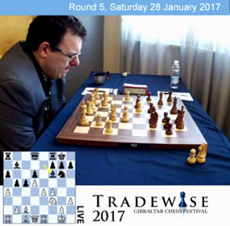

## Round 6. Emil SUTOVSKY - David ANTON

**1. e4 e5 2. Cf3 Cc6 3. Fb5 a6 4. Fa4 Cf6 5. O-O Fe7 6. Te1 b5 7. Fb3 d6 8. c3 O-O 9. h3 Ca5 10. Fc2 c5 11. d4 Cd7 12. Cbd2 exd4 13. cxd4 Cc6 14. d5 Cce5 15. a4 Fb7**

`C96 Ruy Lopez: closed`  
`r2q1rk1/1b1nbppp/p2p4/1ppPn3/P3P3/5N1P/1PBN1PP1/R1BQR1K1 w - - 1 16`

La famille d'Emil [**SUTOVSKY**][1] émigra en Israël dans les dernières années de l'existence de l'Union Soviétique.

Avant cette partie, il avait déjà affronté à deux reprises avec les Blancs la même ouverture :

* le 20.06.2005 à la 8ème Ronde du III Marx Georgy de Paks (Hongrie) contre le Hongrois Peter ACS (`Elo 2525`) où il avait lui-même divergé par 12. d5 (`+0.16 Stockfish 6 10'`) ; après 12... Cc4 13. b3 Ccb6 14. a4 bxa4 15. bxa4 (`+0.51 Stockfish 6 10'`), il domina longtemps avant de se tromper tactiquement et s'incliner en 46 coups ;  
* au Championnat d'Europe à Aix-les-Bains face à Luka LENIC (Slovénie - `Elo 2623`) (8ème Ronde - 30.03.2011) où il préféra mettre son Roi à l'abri par 12. Rh1 (`+0.00 Stockfish 6 10'`) ; cette fois là, il s'imposa en 37 coups.

Théoricien chevronné, il ne se laisse pas surprendre et emprunte face à Anton la variante déjà explorée dans 26 parties avant lui : `+9 =12 -5` (soit 15/26 pour les Blancs - taux de succès : 57,7 % )

  
Emil **SUTOVSKY** 

  
Il choisit **16. Cxe5** afin de pouvoir le déloger *via* f2-f4. Et en effet, il suit **16... Cxe5** (16... dxe5 offrirait un pion passé aux Blancs sur un plateau d'argent) **17. f4**

 Position après **17. f4**  
`r2q1rk1/1b2bppp/p2p4/1ppPn3/P3PP2/7P/1PBN2P1/R1BQR1K1 b - f3 0 17`

La question qui se pose à David [**ANTON**][2] est donc de choisir la case d'où le Cavalier pourrait exercer le plus d'influence sur le jeu.

* on se rend compte rapidement que 17... Cc4 permettrait 18. Cxc4 dxc4 avec une structure de pions en charpie ; en outre, le pion c4 est indéfendable (`+0.56 Stockfish_14053109_32bit 10'`)  
* par contre, 17... Cd7 a pour effet de renforcer la tête de pont c5 sur l'Aile Dame et de laisser les coudées franches à la contre-attaque sur l'Aile Roi *via* f7-f5 ; placer le Cavalier en d7 le cantonne désormais à un rôle strictement défensif (bien inférieur à celui qu'il jouait en e5) et condamne le Fb7, voire la Tour a8 à une passivité complète.

> Cette continuation semble délicate, du point de vue des Noirs. En effet, dans une partie entre Veselin [**TOPALOV**][3] et Michael [**ADAMS**][4] qui continua par 17... Cd7 18. Cf3 Te8 19. Fd2, le Britannique se priva de la réaction thématique f7-f5 en jouant 19... Ff6 ; il subit ensuite avant d'être finalement submergé par les pions d et e.  
> (Topalov-Adams, Cap d'Agde (2), 24.10.2003, 1-0, 48.)

* et donc, il y a **17... Cg6** que choisit Anton.

En réponse, Sutovsky consolide son centre grâce à **18. Cf3**  
Il dégage du même coup la diagonale c1/h6.

Refaisons le point par rapport au [**diagramme**][5] de la page consacrée aux [**quinze premiers coups**][6] de la partie : quelles ont été les contre-mesures prises par Emil Sutovsky pour contrer les points forts de son adversaire, à savoir les cases (marquées en vert) b5-c5 (`duo de pions`) et e5 ([**Cavalier optimisé**][7], car centralisé) ?

* il est incontestable que les Blancs ont pris le dessus à l'Aile Roi, grâce à la constitution d'un autre `duo` (e4-f4) puissamment soutenu par le Cf3, les Fous c1 et c2 et par la Tour e1 ;  
* ils continuent également à annihiler l'action du Fb7 ;  
* par contre, rien n'a été entrepris contre les pions de l'Aile Dame ;  
* une concession a été faite au niveau des cases noires : en particulier, le contrôle par la `batterie D-F` de la diagonale d8/h4 et, potentiellement, de h4/e1, pourrait devenir une source de préoccupation.

C'est ce point faible des Blancs que David Anton met en évidence. Il joue quasi instantanément (moins de 50", ce qui pousse son adversaire à [**revenir précipitamment se rasseoir**](18---Bf6.mp4)) **18... Ff6**

  
*Cinq minutes de réflexion plus tard, Sutovski ne semble vraiment pas à la fête.*

[1]: https://en.wikipedia.org/wiki/Emil_Sutovsky
[2]: https://fr.wikipedia.org/wiki/David_Ant%C3%B3n_Guijarro
[3]: https://en.wikipedia.org/wiki/Veselin_Topalov
[4]: https://en.wikipedia.org/wiki/Michael_Adams_(chess_player)
[5]: https://bobjr-1.github.io/ChessAdventures/Gibraltar_2017/Diag_01c.png
[6]: https://bobjr-1.github.io/ChessAdventures/Gibraltar_2017/Anton.html
[7]: https://sites.google.com/site/rdchessfra/lesson_04/lesson_04_02

