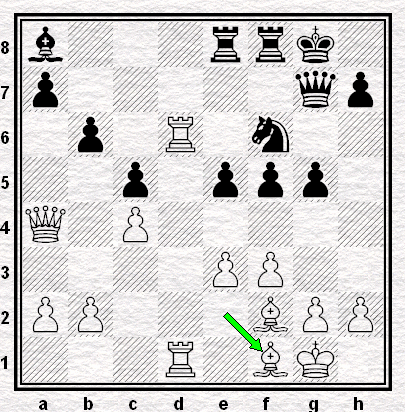
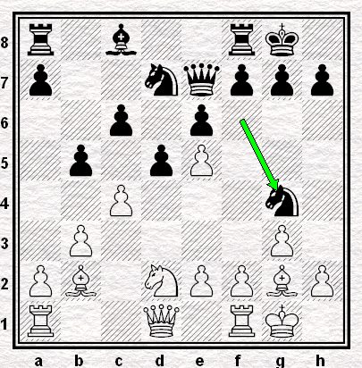

## Percées de pion(s)

> **Bauernduchbrüche** bedeuten fast immer die Hauptkrise der Partie. Glänzende Beispiele weisen auf [vier] Partien  
> `TRADUCTION :`*Les percées de pions corrrespondent presque toujours aux moments de crise principaux de la partie. [En voici] des exemples remarquables dans [quatre] parties.*

[TOC]

#### Capablanca - Spielmann (Ronde 1 - 19.02.1927)

La position à partir de laquelle le coup thématique de percée de pion a été soumise à l'analyse de `Stockfish 6` pendant 30", puis 1', 1'30", 2' et enfin 5'.  

> Les coups retenus en priorité par l'ordinateur sont représentés dans le petit diagramme, ci-dessous à droite.

`r1b4r/p2nkpp1/5n1p/1p1p4/2pP3B/P7/1P1NPPPP/R3KB1R w KQ b6 0 14` 
 

| Meilleur coup envisagé | 1° | 2° | 3° | 4° | 5° | 6° |
| --- | --- | --- | --- | --- | --- | --- |
| <b>après 30 secondes</b> | e3 `-0.09` | f3 `-0.11` | f4 `-0.16` | e4 `-0.24` | Tc1 `-0.29` | Fg3 `-0.32` |
| <b>après 60 secondes</b> | f3 `-0.06` | e3 `-0.10` | f4 `-0.14` | h3 `-0.17` | e4 `-0.25` | Fg3 `-0.34` |
| après 90 secondes | f4 `-0.05` | e3 `-0.12` | e4 `-0.14` | f3 `-0.17` | h3 `-0.20` | Tc1 `-0.27` |
| après 120 secondes | f4 `-0.11` | e3 `-0.12` | f3 `-0.14` | e4 `-0.14` | h3 `-0.20` | Tc1 `-0.27` |
| après 300 secondes | f4 `-0.10` | Tc1 `-0.10` | e3 `-0.17` | f3 `-0.18` | h3 `-0.24` | e4 `-0.25` |

Plus impulsif, Capablanca a choisi de faire irruption au centre par **14. e4**

#### Vidmar - Nimzovitch (Ronde 5 - 24.02.1927)

#### Vidmar - Nimzovitch (Ronde 14 - 12.03.1927)

#### Alekhine - Spielmann (Ronde 19 - 20.03.1927)

