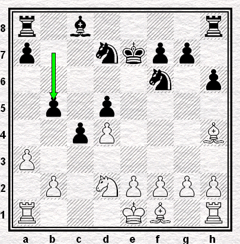
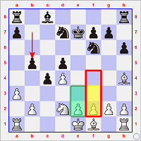
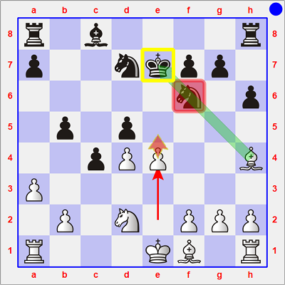
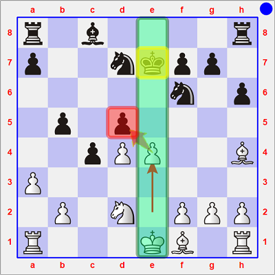
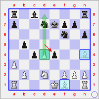
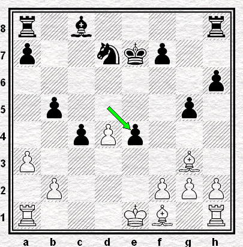
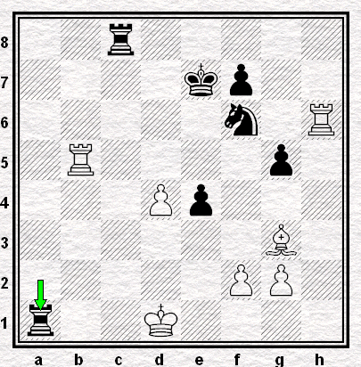

## Percées de pion(s)

> **Bauernduchbrüche** bedeuten fast immer die Hauptkrise der Partie. Glänzende Beispiele weisen auf [vier] Partien  
> `TRADUCTION :`*Les percées de pions corrrespondent presque toujours aux moments de crise principaux de la partie. [En voici] des exemples remarquables dans [quatre] parties.*

Les quatre parties analysées sont :

* (ci-dessous) Capablanca - Spielmann (Ronde 1 - 19.02.1927)
* [**Vidmar - Nimzovitch**](01b.md) (Ronde 5 - 24.02.1927)
* [**Vidmar - Nimzovitch**](01c.md) (Ronde 14 - 12.03.1927)
* [**Alekhine - Spielmann**](01d.md) (Ronde 19 - 20.03.1927)

---

#### Capablanca - Spielmann (Ronde 1 - 19.02.1927)

> Données biographiques de Jose Ra&uacute;l [**CAPABLANCA**][1] et de Rudolf [**SPIELMANN**][2]

La position à partir de laquelle le coup thématique de percée de pion a été soumise à l'analyse de `Stockfish 6` pendant 30", puis 1', 1'30", 2' et enfin 5'.  

> Les coups retenus en priorité par l'ordinateur sont représentés dans le petit diagramme, ci-dessous à droite.

`r1b4r/p2nkpp1/5n1p/1p1p4/2pP3B/P7/1P1NPPPP/R3KB1R w KQ b6 0 14` 
 

| Meilleur coup envisagé | 1° | 2° | 3° | 4° | 5° | 6° |
| --- | --- | --- | --- | --- | --- | --- |
| <b>après 30 secondes</b> | e3 `-0.09` | f3 `-0.11` | f4 `-0.16` | e4 `-0.24` | Tc1 `-0.29` | Fg3 `-0.32` |
| <b>après 60 secondes</b> | f3 `-0.06` | e3 `-0.10` | f4 `-0.14` | h3 `-0.17` | e4 `-0.25` | Fg3 `-0.34` |
| après 90 secondes | f4 `-0.05` | e3 `-0.12` | e4 `-0.14` | f3 `-0.17` | h3 `-0.20` | Tc1 `-0.27` |
| après 120 secondes | f4 `-0.11` | e3 `-0.12` | f3 `-0.14` | e4 `-0.14` | h3 `-0.20` | Tc1 `-0.27` |
| après 300 secondes | f4 `-0.10` | Tc1 `-0.10` | e3 `-0.17` | f3 `-0.18` | h3 `-0.24` | e4 `-0.25` |

<u>>14. f4</u>, qui cherche à occuper le centre au risque de laisser des `cases faibles` à ses côtés (e4, g4) et derrière lui (e3, g3), <u>14. e3</u>, qui consolide le pion d avant d'envisager gagner du terrain à l'Aile Roi, voire <u>14. f3</u>, qui prépare la poussée e2-e4, sont les trois idées privilégiées par l'ordinateur en ce début de XXIème Siècle.

---

Plus impulsif, Capablanca choisit quant à lui de faire sans attendre irruption au centre par **14. e4**

> #### Aucune préparation d'artillerie
> ... telle est l'idée #1 des `Bauerndurchbrüche`

Ce coup est très offensif, car il contient deux menaces.

<b>Menace 1</b>  
tirer parti du clouage et de la position malheureuse (momentanée) du Roi.  
  
Les Blancs menacent de jouer 15. e5 de s'emparer ensuite du Cavalier.

Le meilleur moyen de s'extirper de ce `clouage absolu` est de jouer **14... g5** ; c'est le coup choisi par Spielmann dans la partie. Nous y reviendrons en fin de page.  
Mais il y a aussi 14... Re8 ou 14... Re6 qui évacuent le Roi de la diagonale h4/d8, mais qui s'exposent à la seconde **Menace 2**.

<b>Menace 2</b>  
chercher à ouvrir la colonne e, sur laquelle se trouve le Roi.  
   
Les Blancs menacent en effet également de s'emparer du pion d5, puis d'effectuer le grand roque.  
Plutôt que 14... Fb7 (qui, certes, protège le pion d5 mais oublie l'imminence de la **Menace 1**), les Noirs disposent de 14... dxe4.

> Le petit diagramme de droite montre toutefois qu'après 14... dxe4, les Blancs disposent de la paire de Fous et d'un `pion passé` d4 dont les Noirs auront sans doute bien du mal à contenir la progression.

---

Revenons au coup de la partie : **14... g5**.  
Celui-ci entraîne la suite plus ou moins forcée : **15. Fg3 Cxe4 16. Cxe4 dxe4**

`r1b4r/p2nkp2/7p/1p4p1/2pPp3/P5B1/1P3PPP/R3KB1R w KQ - 0 17` 

Les Blancs ont également un pion d passé, la paire de Fous et la possibilité d'effectuer le grand roque, mais les Noirs disposent d'une majorité de pions à l'Aile Roi (e4, f7, g5, h6) qui a bien progressé et qui pourrait entraver l'action des Fous adverses.

> #### Provoquer des conséquences aisément calculables
> ... et susceptibles de mener à un jeu agréable  
> telle est l'idée #2 des `Bauerndurchbrüche`

 **position finale** (après 28... Ta1+)

Les caractéristiques de la position n'ont guère évolué : les contours de la partie étaient donc aisément calculables.

On remarque en effet que les Blancs ont dû céder la paire de Fous et un jeu actif aux Tours adverses. Peut-être auraient-ils pu mobiliser rapidement leur forces par O-O-O et "pousser" ensuite par d4-d5.  
Quant aux Noirs, ils ont veillé à positionner leur Cavalier en f6 pour entraver la progression du pion d4 ... mais cela les a empêché d'effectuer le coup "libérateur" f7-f5.

[1]: https://fr.wikipedia.org/wiki/Jos%C3%A9_Ra%C3%BAl_Capablanca
[2]: https://fr.wikipedia.org/wiki/Rudolf_Spielmann
