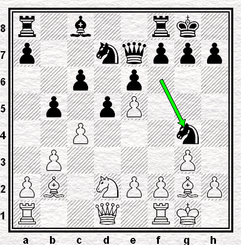

## Percées de pion(s)

### Vidmar - Nimzovitch (Ronde 14 - 12.03.1927)

Les deux mêmes adversaires de la [**cinquième Ronde**](01b.md) illustrent ici le thème de la percée de pion(s) de manière quelque peu différente.

