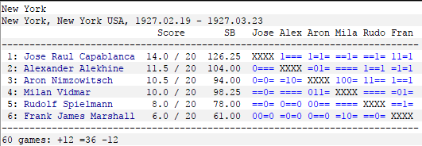

## Les grands thèmes tactiques du Tournoi de New York 1927

Dans les archives du "*Wiener Schachzeitung*", qui fut la revue de référence des dernières années de l'Empire austro-hongrois et de l'Entre-Deux-Guerres sous la direction de Georg [**MARCO**][1], j'ai retrouvé un très intéressant article rédigé par Savielly [**TARTAKOVER**][2].

Il y s'agit, non d'analyses de parties entières, ni de combinaisons développées à partir de positions, ni même d'études de finales. L'article dédaigne même le classement du tournoi dont il est question, à savoir celui de New York, disputé à la fin de l'hiver 1927.

Jose Raul [**CAPABLANCA**][3] Champion du Monde (depuis son match de 1921 à La Havane contre Emanuel [**LASKER**][4] largement remporté `+4 =10 -0`) s'imposa très largement, demeura invaincu. Incontestablement, New York 1927 marque l'apogée du géant cubain.  
Surtout, il devança très nettement à New York son futur *Challenger* pour le titre mondial, le Russe *blanc* Alexander [**ALEKHINE**][5], à quelques mois de leur affrontement de Buenos Aires.

L'article co-signé par Marco et Tartakover a le mérite de s'extirper des aspects sportifs de ce long tournoi, où chaque protagoniste a rencontré à quatre reprises ses adversaires pour s'attacher aux apports de ces 60 parties à la pratique des &Eacute;checs.

Découvrons ces thèmes et les progrès ainsi réalisés dans la compréhension du Jeu.

[**01.** Percée(s) de pions](01.md)

[1]: https://fr.wikipedia.org/wiki/Georg_Marco
[2]: https://fr.wikipedia.org/wiki/Xavier_Tartakover
[3]: https://fr.wikipedia.org/wiki/Jos%C3%A9_Ra%C3%BAl_Capablanca
[4]: https://fr.wikipedia.org/wiki/Emanuel_Lasker
[5]: https://fr.wikipedia.org/wiki/Alexandre_Alekhine
